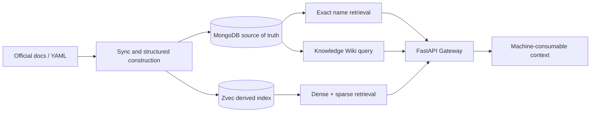

# RAG With Cold API Documents

English | [简体中文](./README.md)

[](https://www.python.org/)
[](https://fastapi.tiangolo.com/)
[](https://docs.astral.sh/uv/)
[](https://github.com/alibaba/zvec)

A **versioned, namespace-isolated, machine-consumable** API documentation retrieval and trusted-context service for coding agents. It reduces hallucinations and misuse when agents work with unfamiliar, version-sensitive, or similarly named APIs.

The repository currently contains four independently runnable or composable paths:

- API documentation RAG: exact name lookup and natural-language retrieval with mandatory `namespace + version` scope.
- Knowledge Wiki: compile source-part documents into evidence-backed knowledge cards, then query, rerank, and build bounded Recall Capsules independently.
- Document construction and synchronization: fetch allowlisted sources, extract Markdown, convert to profile YAML, and write Zvec with dry-run, incremental sync, and resume support.
- Relation graph and benchmarks: maintain Knowledge relations and provide Knowledge regression cases plus a public CANN Judge dataset synchronizer.

## Understand it in 30 seconds



Core principles:

1. **Version-first**: valid documents and retrieval results carry version metadata.
2. **Namespace isolation**: same-name APIs from different products, namespaces, or versions cannot contaminate one another.
3. **Machine-first output**: return signatures, parameters, return values, examples, sources, and constraints instead of only HTML fragments.
4. **Traceability**: query records, evidence, publication state, and index state are persisted separately.
5. **Rebuildability**: MongoDB stores facts and publication state; Zvec is a rebuildable derived index.

## Documentation

| Topic | Document |
|---|---|
| Local setup, MongoDB, service startup, queries, and YAML ingestion | [Quick Start](docs/quick-start.md) |
| System boundaries, data flow, state machine, and index consistency | [Architecture](docs/architecture.md) |
| API Gateway request/response examples | [Gateway README](src/gateway/README.md) |
| Knowledge Wiki product semantics and code map | [Knowledge README](src/knowledge/README.en.md) / [中文](src/knowledge/README.md) |
| Knowledge read-only query contract | [Knowledge Query](docs/knowledge-query.md) |
| Knowledge update pipeline | [Knowledge Update Plane](docs/knowledge-update-plane.md) |
| MongoDB connection, initialization, and troubleshooting | [MongoDB setup](docs/mongodb.md) |
| Official Markdown synchronization | [Document Sync Operations](docs/document-sync-setup.md) |
| Source crawler design | [Data Collection Layer](docs/data-collection-layer-crawler.md) |
| API relation modeling and graph | [Relation Modeling](docs/relations.md) |
| Product rationale and use cases | [Advantages](docs/advantages.md) |
| Benchmark standards and labels | [Benchmark standard](benchmark/doc/benchmark_评测标准.md) / [Labels](benchmark/doc/benchmark_标签解释.md) |
| Third-party notices | [THIRD_PARTY_NOTICES.md](THIRD_PARTY_NOTICES.md) |

## Platform and dependencies

| Area | Current implementation |
|---|---|
| Python | `>=3.14` |
| Package manager | [uv](https://docs.astral.sh/uv/) |
| Web service | FastAPI + Uvicorn |
| Source of truth | MongoDB 8.x or MongoDB Atlas |
| Vector index | Zvec `>=0.6.0`, in-process; no separate vector service required |
| Primary embedding path | DashScope `qwen3.7-text-embedding`, 2048 dimensions |
| Offline embedding path | `sentence-transformers/all-MiniLM-L6-v2`, 384 dimensions |
| Document conversion | Python rule-based parsing plus optional OpenAI-compatible LLM / DashScope flows |

## Quick Start

The following starts the full API documentation query service. See the [full Quick Start](docs/quick-start.md) for detailed troubleshooting.

### 1. Install dependencies

```bash
uv sync
```

### 2. Configure the environment

```bash
cp .env.example .env
```

At minimum, configure DashScope and MongoDB:

```ini
DASHSCOPE_API_KEY=your-dashscope-api-key
RAG_MONGO_URI=mongodb://127.0.0.1:27017
RAG_MONGO_DATABASE=rag_cold_api
RAG_MONGO_INIT_MODE=auto
```

`.env` is ignored by Git. Load it before starting the service, ingestion, or semantic queries:

```bash
set -a
source .env
set +a
```

Never put API keys in `config.yaml`.

### 3. Start MongoDB

For local development:

```bash
docker run -d \
  --name rag-mongodb \
  -p 27017:27017 \
  -v rag-mongodb-data:/data/db \
  mongo:8.0
```

### 4. Start FastAPI

```bash
uv run uvicorn src.main:app --reload
```

After startup:

- Swagger UI: <http://127.0.0.1:8000/docs>
- OpenAPI JSON: <http://127.0.0.1:8000/openapi.json>
- Static web assets, when enabled: <http://127.0.0.1:8000/web>

Startup initializes MongoDB collections and indexes. If MongoDB is unavailable, the application may enter a degraded mode, but storage-backed query endpoints return `503`.

### 5. Query an API document

Exact name lookup:

```bash
curl -sS -X POST 'http://127.0.0.1:8000/api/v1/agent/query/once' \
  -H 'Content-Type: application/json' \
  -d '{
    "query": "ListTensorDesc",
    "query_type": "name",
    "top_k": 5,
    "filters": {
      "namespace": "com.huawei.cann.ascendc.op.910beta3",
      "version": "910beta3",
      "language": "cpp"
    }
  }'
```

For natural-language retrieval, change `query_type` to `semantic`. This calls the configured embedding provider and may incur API usage. `namespace` and `version` are mandatory filters.

## Configuration

### `config.yaml`

The global configuration controls embeddings, Zvec, API-name normalization, and Markdown → YAML AI nodes. Key defaults:

```yaml
embedder:
  type: bailian # bailian | local
  bailian:
    model: qwen3.7-text-embedding
    dimension: 2048

zvec:
  collection_path: ./data/zvec_collections
  default_collection: ascendc_api
```

Set `embedder.type` to `local` for offline embeddings. The local model may be downloaded on first use.

### Important environment variables

| Variable | Purpose |
|---|---|
| `DASHSCOPE_API_KEY` | Bailian embeddings; required by the default semantic query and YAML ingestion paths |
| `RAG_MONGO_*` | MongoDB URI, database, collections, pool, and initialization mode; see `.env.example` |
| `KNOWLEDGE_API_KEY` | Bearer / `X-API-Key` authentication for Knowledge and Graph routes |
| `KNOWLEDGE_LLM_API_KEY` / `OPENAI_API_KEY` | Enables Knowledge update writes; the former takes priority |
| `KNOWLEDGE_LLM_BASE_URL` / `OPENAI_BASE_URL` | Optional OpenAI-compatible provider URL |
| `KNOWLEDGE_LLM_MODEL` / `OPENAI_MODEL` | Optional Knowledge model name; defaults to `gpt-4o-mini` |
| `RAG_CONSTRUCTION_ZVEC_STORES` | JSON mapping from construction store aliases to collections |
| `RAG_CONSTRUCTION_DOCUMENT_SYNC_CONFIG` | Document-sync config used by the construction service |
| `RAG_YAML_IMPORT_ALLOWED_ROOTS` | Directories allowed by the YAML admin importer |
| `RAG_YAML_IMPORT_MAX_FILE_BYTES` | Per-file YAML read limit |
| `MINIMAX_API_KEY` | Required by `src/script/extract_docs.py` when AI nodes are enabled |

## HTTP API overview

Use the OpenAPI document at `/docs` as the source of truth. Main routes:

| Route | Purpose | Authentication |
|---|---|---|
| `POST /api/v1/agent/query/once` | Single API documentation query | No built-in service key; deploy behind a controlled network or upstream gateway |
| `POST /api/v1/agent/query/batch` | Batch API documentation queries | Same as above |
| `POST /api/v1/knowledge/query` | Query published Knowledge Artifacts | `KNOWLEDGE_API_KEY` |
| `POST /api/v1/knowledge/update` | LLM extraction, evidence validation, and Knowledge publication | `KNOWLEDGE_API_KEY` + LLM key |
| `GET /api/v1/graph/edges` | Query relations for a scope | `KNOWLEDGE_API_KEY` |
| `POST /api/v1/graph/link/confirm` | Confirm or reject a relation | `KNOWLEDGE_API_KEY` |
| `POST /api/v1/admin/rag-construction/markdown/extract` | Extract Markdown through a source adapter | Add external authentication in deployment |
| `POST /api/v1/admin/rag-construction/yaml/convert` | Markdown → profile YAML | Add external authentication in deployment |
| `POST /api/v1/admin/rag-construction/zvec/index` | Validate YAML and write Zvec | Add external authentication in deployment |
| `POST /api/v1/admin/rag-construction/pipeline/run` | Extract → convert → index | Add external authentication in deployment |
| `POST /api/v1/admin/yaml-imports/batch` | Batch import YAML into MongoDB | Add external authentication in deployment |

Knowledge query contracts, budgets, and boundaries are documented in [docs/knowledge-query.md](docs/knowledge-query.md). Knowledge updates do not accept a Markdown file path; callers must first construct a `KnowledgeDocumentInput` with stable `SourcePart` values.

## Ingestion and maintenance commands

### YAML → Zvec

```bash
uv run python src/script/ingest.py \
  ingest/output/Sub/SIMD_API/其他数据类型/ListTensorDesc.yaml \
  --dry-run

uv run python src/script/ingest.py \
  ingest/output/Sub/SIMD_API/其他数据类型/ListTensorDesc.yaml \
  --collection ascendc_api
```

### Incremental official Markdown sync

Preview first, then apply:

```bash
uv run python -m src.script.sync_docs sync \
  --config configs/document_sync.yaml \
  --dry-run

uv run python -m src.script.sync_docs sync \
  --config configs/document_sync.yaml \
  --apply
```

Or use the wrapper:

```bash
./run-sync.sh --dry-run
./run-sync.sh --foreground --apply
```

Sync writes manifests, journals, locks, and logs under `data/doc_sync/`. `run-sync.sh` runs in the background by default and includes a watchdog. See [Document Sync Operations](docs/document-sync-setup.md).

### Rebuild the Knowledge index

```bash
uv run python -m src.cli.knowledge reindex --dry-run

uv run python -m src.cli.knowledge reindex \
  --wiki-id wiki-ascendc \
  --namespace AscendC \
  --version 910beta3
```

### Knowledge Graph

```bash
uv run python -m src.cli.graph stats \
  --wiki-id wiki-ascendc \
  --namespace AscendC \
  --version 910beta3
```

Run `uv run python -m src.cli.graph --help` for the complete `build`, `upsert`, `stats`, and `export` options.

### CANN Judge benchmark synchronization

```bash
uv run python -m benchmark.cannjudge.sync
```

The synchronizer only accesses public read-only APIs. It does not read cookies, store credentials, or submit code automatically. See [benchmark/cannjudge/README.md](benchmark/cannjudge/README.md).

## Zvec Studio and file locks

To inspect the default collection:

```bash
uv pip install zvec-studio
.venv/bin/zvec-studio --host 127.0.0.1 --port 7860
```

Open <http://127.0.0.1:7860> and select:

```text
$PWD/data/zvec_collections/ascendc_api
```

Studio holds a `LOCK` while a collection is open. Close the collection or stop Studio before ingestion, reindexing, or querying. Never delete the `LOCK` file manually.

The current collection uses sparse vectors with dynamic dimension `dimension=0`. If Studio reports that `VectorSchema.dimension` must be at least `1`, the installed `zvec-studio` version likely replaced the local compatibility fix. Reapply the project-environment fix or upgrade to a release with official sparse `dimension=0` support.

## Project structure

```text
.
├── src/main.py                 # FastAPI application and lifespan wiring
├── src/gateway/                # HTTP routes, schemas, and authentication
├── src/service/                # Query, construction, and import services
├── src/knowledge/              # Knowledge Wiki, evidence, query, and graph
├── src/dao/                    # MongoDB DAOs and embedding/Zvec adapters
├── src/doc_sync/               # Source adapters, fetching, diff, and resume
├── src/script/                 # Sync, ingestion, extraction, and maintenance scripts
├── src/cli/                    # Knowledge and Graph maintenance CLIs
├── benchmark/                  # Benchmark cases, generators, and CANN Judge adapter
├── schemas/                    # API-document YAML schemas
├── docs/                       # Architecture, operations, data, and evaluation docs
├── tests/unit/                 # Default unit tests
├── tests/integration/          # Tests requiring MongoDB or external APIs
├── tests/benchmark/            # Retrieval-strategy regression tests
├── config.yaml                 # Embedding, Zvec, and document-conversion config
└── .env.example                # MongoDB and importer environment template
```

## Development and verification

```bash
# Default unit tests
uv run pytest tests/unit

# Integration tests (MongoDB required; some tests require real API keys)
uv run pytest tests/integration

# Benchmark regression
uv run pytest tests/benchmark

# Lint and formatting
uv run ruff check .
uv run ruff format --check .
```

For the live Bailian test:

```bash
RUN_BAILIAN_LIVE=1 DASHSCOPE_API_KEY=your-key \
  uv run pytest tests/integration/test_bailian_live.py
```

The end-to-end local-embedding smoke test is `tests/manual/smoke_e2e.py`; it uses a temporary Zvec directory and does not modify the default collection. Strict public-API type checking can be run after installing `mypy` in the development environment; it is not currently declared as a dev dependency in `pyproject.toml`.

## Current boundaries

- Knowledge queries read only published Artifacts and the independent Knowledge Zvec index. They do not fall back to the lower API RAG, call an LLM, or write storage.
- The Knowledge intake layer does not parse Markdown file paths; an upstream adapter must create stable, ordered `SourcePart` values.
- Zvec is a derived index, not the source of truth. Rebuild it from the MongoDB active Catalog when necessary.
- Do not commit `data/`, crawled artifacts, model caches, or local secrets.
- Before exposing the service publicly, add upstream authentication, network isolation, and rate limiting for administrative routes that do not currently include a service-key dependency.

## Contributing and security

Before submitting changes, run at least `uv run ruff check .` and the relevant tests. New retrieval strategies should include unit tests and a Benchmark case. Preserve the official casing and dot-separated form of `namespace` and `version`.

The repository currently has no formal `SECURITY.md` or security-reporting email. Do not disclose vulnerabilities through public Issues; the formal private disclosure channel needs to be added. The repository also has no root `LICENSE` file; licensing information for included third-party material is in [THIRD_PARTY_NOTICES.md](THIRD_PARTY_NOTICES.md), while the project license itself needs to be added.

Current package version: `0.1.0`. Release and changelog procedures need to be added.
