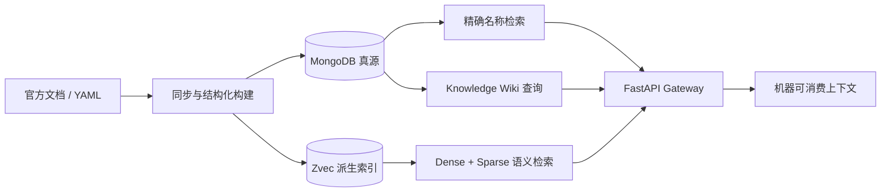

# RAG With Cold API Documents

[English](./README.en.md) | 简体中文

[](https://www.python.org/)
[](https://fastapi.tiangolo.com/)
[](https://docs.astral.sh/uv/)
[](https://github.com/alibaba/zvec)

为代码 Agent 提供**版本化、命名空间隔离、机器可消费**的 API 文档检索与可信上下文服务，降低陌生 API、版本敏感 API 和同名 API 带来的幻觉与误用。

项目当前包含四条可独立运行或组合的链路：

- API 文档 RAG：按名称精确查询或按自然语言语义检索，强制携带 `namespace + version` 范围。
- Knowledge Wiki：把带来源分段的文档编译成带证据的知识卡片，独立完成查询、重排和 Recall Capsule 构建。
- 文档构建与同步：从白名单来源提取 Markdown，转换为 Profile YAML，再写入 Zvec；支持 dry-run、增量同步和恢复。
- 关系图与 Benchmark：维护 Knowledge 关系边，并提供 Knowledge 回归 case 与 CANN Judge 公开题库同步器。

## 30 秒了解



核心设计原则：

1. **Version-first**：有效文档和召回结果都带版本元数据。
2. **Namespace isolation**：不同产品、命名空间和版本的同名 API 不能互相污染。
3. **Machine-first**：返回签名、参数、返回值、示例、来源和约束，而不是只返回 HTML 片段。
4. **可追溯**：查询记录、知识证据、发布状态和索引状态分别留痕。
5. **可重建**：MongoDB 保存事实和发布状态，Zvec 是可重建的派生索引。

## 文档导航

| 主题 | 文档 |
|---|---|
| 本地安装、MongoDB、启动服务、查询和 YAML 摄取 | [快速开始](docs/quick-start.md) |
| 系统边界、数据流、状态机和索引一致性 | [架构设计](docs/architecture.md) |
| API 文档 Gateway 的请求/响应示例 | [Gateway README](src/gateway/README.md) |
| Knowledge Wiki 的产品语义和代码落点 | [Knowledge README](src/knowledge/README.md) / [English](src/knowledge/README.en.md) |
| Knowledge 只读查询契约 | [Knowledge Query](docs/knowledge-query.md) |
| Knowledge 更新链路 | [Knowledge Update Plane](docs/knowledge-update-plane.md) |
| Agent Platform 设计与本地运行 | [Agent Platform](docs/agent-platform.md) |
| MongoDB 连接、初始化和故障排查 | [MongoDB 配置](docs/mongodb.md) |
| 官网 Markdown 文档同步 | [文档同步初始化与运维](docs/document-sync-setup.md) |
| 数据采集层爬虫设计 | [数据采集层说明](docs/data-collection-layer-crawler.md) |
| API 关系建模和图谱 | [关系建模](docs/relations.md) |
| 产品差异化说明 | [优势与适用场景](docs/advantages.md) |
| Benchmark 评测标准和标签 | [评测标准](benchmark/doc/benchmark_评测标准.md) / [标签解释](benchmark/doc/benchmark_标签解释.md) |
| 第三方许可声明 | [THIRD_PARTY_NOTICES.md](THIRD_PARTY_NOTICES.md) |

## 平台与依赖

| 项目 | 当前实现 |
|---|---|
| Python | `>=3.14` |
| 包管理 | [uv](https://docs.astral.sh/uv/) |
| Web 服务 | FastAPI + Uvicorn |
| 事实存储 | MongoDB 8.x 或 MongoDB Atlas |
| 向量索引 | Zvec `>=0.6.0`，in-process，不需要单独启动向量服务 |
| Embedding 主路径 | DashScope `qwen3.7-text-embedding`，2048 维 |
| Embedding 离线路径 | `sentence-transformers/all-MiniLM-L6-v2`，384 维 |
| 文档转换 | Python 规则解析 + 可选 OpenAI 兼容 LLM / DashScope 流程 |

## 快速开始

下面的步骤启动完整的 API 文档查询服务。完整说明和排障见[快速开始](docs/quick-start.md)。

### 1. 安装依赖

```bash
uv sync
```

### 2. 配置环境

```bash
cp .env.example .env
```

至少配置 DashScope 和 MongoDB：

```ini
DASHSCOPE_API_KEY=你的百炼APIKey
RAG_MONGO_URI=mongodb://127.0.0.1:27017
RAG_MONGO_DATABASE=rag_cold_api
RAG_MONGO_INIT_MODE=auto
```

`.env` 已被 Git 忽略。执行服务、摄取或语义查询前，把变量加载到当前终端：

```bash
set -a
source .env
set +a
```

不要把 API Key 写入 `config.yaml`。

### 3. 启动 MongoDB

开发环境可直接使用 Docker：

```bash
docker run -d \
  --name rag-mongodb \
  -p 27017:27017 \
  -v rag-mongodb-data:/data/db \
  mongo:8.0
```

### 4. 启动 FastAPI

```bash
uv run uvicorn src.main:app --reload
```

启动后可访问：

- Swagger UI：<http://127.0.0.1:8000/docs>
- OpenAPI JSON：<http://127.0.0.1:8000/openapi.json>
- Web 静态资源（若启用）：<http://127.0.0.1:8000/web>

服务启动时会初始化 MongoDB Collection 和索引。MongoDB 不可用时，应用可以进入降级状态，但依赖真实存储的查询接口会返回 `503`。

### 5. 查询 API 文档

按名称精确查询：

```bash
curl -sS -X POST 'http://127.0.0.1:8000/api/v1/agent/query/once' \
  -H 'Content-Type: application/json' \
  -d '{
    "query": "ListTensorDesc",
    "query_type": "name",
    "top_k": 5,
    "filters": {
      "namespace": "com.huawei.cann.ascendc.op.910beta3",
      "version": "910beta3",
      "language": "cpp"
    }
  }'
```

自然语言语义查询只需将 `query_type` 改为 `semantic`；此路径会调用配置的 Embedding provider，并可能产生 API 用量。`namespace` 和 `version` 是必填过滤条件。

## 配置说明

### `config.yaml`

全局配置文件控制 Embedding、Zvec、API 名称规范化和 Markdown → YAML 的 AI 节点。默认关键项：

```yaml
embedder:
  type: bailian # bailian | local
  bailian:
    model: qwen3.7-text-embedding
    dimension: 2048

zvec:
  collection_path: ./data/zvec_collections
  default_collection: ascendc_api
```

切换到离线 Embedding 时，将 `embedder.type` 改为 `local`；首次运行可能需要下载本地模型。

### 重要环境变量

| 变量 | 用途 |
|---|---|
| `DASHSCOPE_API_KEY` | Bailian Embedding；默认语义查询和 YAML 摄取需要 |
| `RAG_MONGO_*` | MongoDB URI、数据库、Collection、连接池和初始化模式；完整列表见 `.env.example` |
| `KNOWLEDGE_API_KEY` | Knowledge 和 Graph 路由的 Bearer / `X-API-Key` 鉴权 |
| `KNOWLEDGE_LLM_API_KEY` / `OPENAI_API_KEY` | 启用 Knowledge 更新写入；二者按前者优先使用 |
| `KNOWLEDGE_LLM_BASE_URL` / `OPENAI_BASE_URL` | 可选的 OpenAI 兼容 provider 地址 |
| `KNOWLEDGE_LLM_MODEL` / `OPENAI_MODEL` | 可选的 Knowledge 模型名，默认 `gpt-4o-mini` |
| `RAG_CONSTRUCTION_ZVEC_STORES` | RAG 构建接口的 store alias → collection 映射（JSON） |
| `RAG_CONSTRUCTION_DOCUMENT_SYNC_CONFIG` | RAG 构建服务使用的文档同步配置路径 |
| `RAG_YAML_IMPORT_ALLOWED_ROOTS` | YAML 管理导入允许读取的目录列表 |
| `RAG_YAML_IMPORT_MAX_FILE_BYTES` | 单个 YAML 文件读取上限 |
| `MINIMAX_API_KEY` | `src/script/extract_docs.py` 的 AI 节点启用时需要 |

## HTTP API 概览

启动服务后，以 `/docs` 中的 OpenAPI 为准。主要路由如下：

| 路由 | 作用 | 鉴权 |
|---|---|---|
| `POST /api/v1/agent/query/once` | 单次 API 文档查询 | 当前路由未内置服务密钥，建议放在受控网络或上游网关后 |
| `POST /api/v1/agent/query/batch` | 批量 API 文档查询 | 同上 |
| `POST /api/v1/knowledge/query` | 查询已发布 Knowledge Artifact | `KNOWLEDGE_API_KEY` |
| `POST /api/v1/knowledge/update` | LLM 提取、证据校验、发布 Knowledge | `KNOWLEDGE_API_KEY` + LLM key |
| `GET /api/v1/graph/edges` | 查询指定 Scope 的关系边 | `KNOWLEDGE_API_KEY` |
| `POST /api/v1/graph/link/confirm` | 确认或拒绝关系链接 | `KNOWLEDGE_API_KEY` |
| `POST /api/v1/admin/rag-construction/markdown/extract` | 从来源 Adapter 提取 Markdown | 部署时请加外部鉴权 |
| `POST /api/v1/admin/rag-construction/yaml/convert` | Markdown → Profile YAML | 部署时请加外部鉴权 |
| `POST /api/v1/admin/rag-construction/zvec/index` | 校验 YAML 并写入 Zvec | 部署时请加外部鉴权 |
| `POST /api/v1/admin/rag-construction/pipeline/run` | 提取 → 转换 → 写入的完整流程 | 部署时请加外部鉴权 |
| `POST /api/v1/admin/yaml-imports/batch` | 批量导入 YAML 到 MongoDB | 部署时请加外部鉴权 |

Knowledge 查询的请求契约、预算和安全边界见 [docs/knowledge-query.md](docs/knowledge-query.md)。Knowledge 写入不接受 Markdown 路径；调用方需先构造带稳定 `SourcePart` 的 `KnowledgeDocumentInput`。

## 数据导入与维护命令

### YAML → Zvec

```bash
uv run python src/script/ingest.py \
  ingest/output/Sub/SIMD_API/其他数据类型/ListTensorDesc.yaml \
  --dry-run

uv run python src/script/ingest.py \
  ingest/output/Sub/SIMD_API/其他数据类型/ListTensorDesc.yaml \
  --collection ascendc_api
```

### 官网 Markdown 增量同步

先预览，再应用：

```bash
uv run python -m src.script.sync_docs sync \
  --config configs/document_sync.yaml \
  --dry-run

uv run python -m src.script.sync_docs sync \
  --config configs/document_sync.yaml \
  --apply
```

也可以使用封装脚本：

```bash
./run-sync.sh --dry-run
./run-sync.sh --foreground --apply
```

同步任务会写入 `data/doc_sync/` 下的 manifest、journal、锁和日志；`run-sync.sh` 默认后台运行并带 watchdog。配置和恢复流程见 [文档同步运维说明](docs/document-sync-setup.md)。

### Knowledge 索引重建

```bash
uv run python -m src.cli.knowledge reindex --dry-run

uv run python -m src.cli.knowledge reindex \
  --wiki-id wiki-ascendc \
  --namespace AscendC \
  --version 910beta3
```

### Knowledge Graph

```bash
uv run python -m src.cli.graph stats \
  --wiki-id wiki-ascendc \
  --namespace AscendC \
  --version 910beta3
```

完整的 `build`、`upsert`、`export` 参数见 `uv run python -m src.cli.graph --help`。

### CANN Judge Benchmark 数据同步

```bash
uv run python -m benchmark.cannjudge.sync
```

该同步器只访问公开只读 API，不读取 Cookie、不保存账号密码，也不会自动提交代码。详情见 [benchmark/cannjudge/README.md](benchmark/cannjudge/README.md)。

## Zvec Studio 与文件锁

查看默认集合：

```bash
uv pip install zvec-studio
.venv/bin/zvec-studio --host 127.0.0.1 --port 7860
```

访问 <http://127.0.0.1:7860>，打开：

```text
$PWD/data/zvec_collections/ascendc_api
```

Studio 打开集合时会持有 `LOCK`。运行摄取、重建或查询前应关闭 Studio 中的集合或停止 Studio；不要手动删除 `LOCK` 文件。

当前集合使用 sparse vector 的动态维度 `dimension=0`。如果 Studio 报 `VectorSchema.dimension` 必须大于等于 `1`，通常是 `zvec-studio` 版本覆盖了本地兼容修复；请重新应用项目环境中的修复，或升级到正式支持 sparse `dimension=0` 的版本。

## 项目结构

```text
.
├── src/main.py                 # FastAPI 应用与生命周期装配
├── src/gateway/                # HTTP 路由、请求/响应模型与鉴权
├── src/service/                # 查询、构建、导入等应用服务
├── src/knowledge/              # Knowledge Wiki、证据校验、查询、图谱
├── src/dao/                    # MongoDB DAO 与 Embedding/Zvec 适配器
├── src/doc_sync/               # 文档来源 Adapter、抓取、diff、恢复
├── src/script/                 # 同步、摄取、抽取和维护脚本
├── src/cli/                    # Knowledge / Graph 维护 CLI
├── benchmark/                  # Benchmark case、生成器和 CANN Judge 适配器
├── schemas/                    # API 文档 YAML Schema
├── docs/                       # 架构、运维、数据模型和评测文档
├── tests/unit/                 # 默认单元测试
├── tests/integration/          # 需要外部 MongoDB / API 的集成测试
├── tests/benchmark/            # 检索策略回归测试
├── config.yaml                 # Embedding、Zvec 和文档转换配置
└── .env.example                # MongoDB / 导入环境变量模板
```

## 开发与验证

```bash
# 默认单元测试
uv run pytest tests/unit

# 集成测试（需要 MongoDB；部分测试需要真实 API key）
uv run pytest tests/integration

# Benchmark 回归
uv run pytest tests/benchmark

# 代码检查与格式化
uv run ruff check .
uv run ruff format --check .
```

只运行百炼在线测试时：

```bash
RUN_BAILIAN_LIVE=1 DASHSCOPE_API_KEY=你的Key \
  uv run pytest tests/integration/test_bailian_live.py
```

端到端本地 Embedding 冒烟测试见 `tests/manual/smoke_e2e.py`；它会使用临时 Zvec 目录，避免修改默认集合。公共 API 的严格类型检查可在开发环境额外安装 `mypy` 后执行，当前 `pyproject.toml` 未将其列入 dev 依赖。

## 当前边界

- Knowledge 查询只读取已发布 Artifact 和独立 Knowledge Zvec，不会回退查询底层 API RAG，也不会在查询时调用 LLM 或写库。
- Knowledge 输入层不负责解析 Markdown 文件路径；上游需要生成稳定、有序的 `SourcePart`。
- Zvec 是派生索引，不是真源；索引损坏时应从 MongoDB 正式 Catalog 重建。
- `data/`、抓取结果、模型缓存和本地密钥不应提交到仓库。
- 生产暴露 API 前，应为当前未内置服务密钥的管理路由增加上游鉴权、网络隔离和限流。

## 贡献与安全

提交前建议至少执行 `uv run ruff check .` 和相关测试。新检索策略应同时增加单元测试和 Benchmark case，并保持 `namespace`、`version` 的官方大小写和点分隔形式。

仓库当前未提供正式 `SECURITY.md` 或安全披露邮箱；安全漏洞请勿提交公开 Issue，正式披露渠道需要补充。仓库当前也未包含根目录 `LICENSE` 文件，许可信息以 [THIRD_PARTY_NOTICES.md](THIRD_PARTY_NOTICES.md) 为准，项目自身许可证需要补充。

当前包版本：`0.1.0`。版本发布与变更日志流程需要补充。
