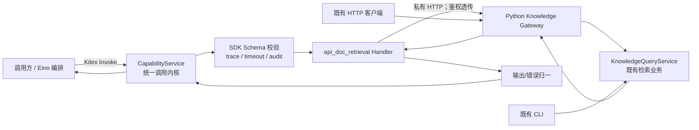

# THRI-236 技术方案：接入 API 文档检索能力

> 状态：建议评审稿（2026-08-06）
> 对应需求：THRI-236《接入 API 文档检索能力》
> 上游契约：THRI-240 §5.1、§6.1 F-01；THRI-234 / 235 / 242

## 1. 方案结论

在 Agent Platform（Go）新增一个静态注册的只读能力
`cap.api_doc.retrieval.v1`。它经由统一调用内核完成请求校验、trace 上下文、30 秒超时、
错误归一与脱敏审计，再以**私有 HTTP 适配器**调用既有 Python Knowledge HTTP 查询入口。

适配器只做字段映射和契约归一；不包含检索、排序、索引或缓存逻辑。已有的维护 CLI 与
`POST /api/v1/knowledge/query` 保持原样，仍由其原有调用者直接使用。



## 2. 现状与设计约束

| 项目 | 现状 / 结论 |
| --- | --- |
| 既有查询入口 | `src/gateway/knowledge_query_router.py` 提供 `POST /api/v1/knowledge/query`；`src/cli/knowledge.py` 为维护 CLI。两者不修改。 |
| 既有 HTTP 入参 | 当前要求 `query`、`wiki_id`、`namespace`、`version`，可选 `top_k` 等字段；与 THRI-240 的能力入参不是一一相同。 |
| 当前 Go 中台 | 仅有 `knowledge.retrieve_context.v1` / `ExecuteKnowledgeAssist`，不能承载本需求的通用 Capability `Discover/Invoke` 契约。 |
| 接入方式 | 优先 HTTP；不把 CLI 当作线上请求回退通道。CLI 回退会产生进程管理、退出码解析和鉴权语义不确定性，且“下游不可达”不应被静默掩盖。若未来确需本地 CLI 模式，应作为显式配置的独立 adapter 并单独验收。 |
| 存储与安全 | Agent Platform 不接入 MongoDB/Zvec/LLM；不新增凭据、数据库或鉴权体系。 |

**需评审确认的矛盾**：PRD A-07 写有“HTTP 不可用时回退 CLI”，但 F-05、E-01 及 AC-03
要求下游不可达返回 `DEPENDENCY_FAILED`。本方案以可观测、确定的错误语义为准：v1 不自动
回退 CLI；将 A-07 调整为“可选、显式配置的后续能力”。

## 3. 架构与模块职责

### 3.1 新增 / 改造模块

| 模块 | 职责 | 禁止事项 |
| --- | --- | --- |
| `internal/capability` | 声明 capability descriptor、manifest 和 schema 引用。 | 不写业务检索规则。 |
| `internal/invocation`（THRI-235） | 能力查找、状态判断、SDK schema 校验、deadline/cancel、trace、审计与统一错误响应。 | handler 自行实现重试、日志脱敏或超时。 |
| `internal/adapter/knowledgequery` | 把能力请求映射成 Python HTTP 请求；透传鉴权与 trace；将响应解码成领域无关 DTO。 | 调整 Python API 响应、修改检索排序。 |
| `internal/handler/apidocretrieval` | 调 adapter，做结果字段补齐/约束校验、最多截断 `max_results` 条。 | 访问存储、缓存或调用 CLI。 |
| `internal/audit` | 本地结构化调用记录；统一字段脱敏。 | 记录 query、正文、Token 或完整 URL。 |
| Python Knowledge Gateway | 保持既有认证、请求和响应语义；若当前字段无法提供 PRD 要求的溯源字段，仅增加**私有适配 DTO**，不改变公开端点。 | 为中台复制一套检索实现。 |

### 3.2 调用顺序

1. Kitex `CapabilityService.Invoke` 接收能力 ID、payload、trace/caller/鉴权元数据。
2. 内核查 manifest：不存在、`disabled`、`offline` 立即返回规范失败响应。
3. THRI-242 校验器按 `cap.api_doc.retrieval.v1.input.json` 校验 payload，并拒绝敏感字段名。
4. 若无 `trace_id`，生成 UUIDv4；嵌套调用直接继承父 trace。
5. 内核将有效 deadline 限制为 `min(调用方 deadline, 30000ms)`，并传给 handler。
6. handler 映射请求并调用 Knowledge HTTP adapter；该调用不自动重试。
7. handler 校验下游响应，截断到 `max_results`，保证 `returned_count == len(results)`。
8. 内核写入脱敏 audit start/end，返回 `InvokeResponse`。

## 4. 契约设计

### 4.1 Manifest

静态 manifest 增加以下条目（路径建议：
`agent-platform/manifests/cap.api_doc.retrieval.v1.json`）：

```json
{
  "capability_id": "cap.api_doc.retrieval.v1",
  "name": "API 文档检索（LLM Wiki 信息 Loop 查找）",
  "module": "api_doc_retrieval",
  "version": "v1.0.0",
  "default_version": "v1.0.0",
  "status": "available",
  "risk_level": "read_only",
  "invocation_mode": "online",
  "execution_mode": "sync",
  "dependencies": ["knowledge.query"],
  "contract_owner": "agent-platform",
  "handler_owner": "knowledge",
  "timeout_policy": {"default_ms": 30000, "max_ms": 30000},
  "retry_policy": {"client_retryable": true, "server_retry": false},
  "input_schema_ref": "schemas/cap.api_doc.retrieval.v1.input.json",
  "output_schema_ref": "schemas/cap.api_doc.retrieval.v1.output.json",
  "risk_notes": "只读；不修改领域数据；可被熔断。",
  "requires_explicit_consent": false,
  "tags": ["read_only", "loop_search"]
}
```

`Discover(read_only)` 直接读取同一份静态 descriptor，禁止另建一份手工维护的能力清单。

### 4.2 能力请求与下游映射

能力输入输出字段严格以 THRI-240 §5.1 为准。为消除当前 HTTP Gateway 与能力契约的差异，
在适配器中维护如下映射，不更改公开 HTTP API。

| 能力字段 | 下游 HTTP 字段 / 来源 | 规则 |
| --- | --- | --- |
| `query` | `query` | 原样传递；禁止改写、翻译、纠错。 |
| `max_results` | `top_k` | `max_results` 默认 5；映射为 `top_k`，响应再做防御性截断。 |
| `scope.wiki_id` | `wiki_id` | 必须由 THRI-240 的 scope 契约或中台配置提供；不能猜测默认值。 |
| `scope.namespace` / `scope.version` | `namespace` / `version` | 版本优先透传；缺失时为 `INVALID_REQUEST`。 |
| `scope.language` | `language` | 有值才透传。 |
| `topic_slug`、`filters`、`hub_root`、`caller` | 仅在既有入口支持时透传 | 入口不支持时不拼接到 query；以审计元数据保留。 |
| 授权上下文 | `Authorization` 及现有服务密钥头 | 值原样透传，仅允许名单内 headers；从不记录。 |
| `trace_id` | `X-Trace-ID`（私有约定） | Python 端不消费也不影响既有行为；仅作关联。 |

如果 THRI-240 §5.1 当前没有 `scope.wiki_id/namespace/version`，则必须在调用请求的公共 envelope
中带入这些路由必需的字段；不能用 `hub_root` 推导 namespace 或 version。该项是实施前的接口确认点。

### 4.3 归一输出

对下游 `QueryKnowledgeResult` 建立纯 DTO 转换，最终结果必须满足：

```json
{
  "results": [{
    "title": "string",
    "source_path": "topics/agent-platform/api-doc.md",
    "topic_slug": "agent-platform",
    "snippet": "最多 500 字符",
    "score": 0.0,
    "matched_at": "2026-08-06T12:00:00Z"
  }],
  "returned_count": 1,
  "loop_hint": {"next_query": "string", "rationale": "string"}
}
```

转换前后检查：`source_path` 只能是 `/` 分隔的相对路径、不得含 `..` 或 URL；`score ∈ [0,1]`；
`matched_at` 必须是 RFC3339 UTC；snippet 以 Unicode 字符截断到 500；空结果是成功。

现有下游若没有 `topic_slug` 或 `matched_at`，应由 Knowledge 领域模块从其已有知识条目元数据提供，
并作为私有 adapter 响应的稳定字段；无法证明来源时拒绝该条目并返回 `INTERNAL_ERROR`，不得伪造。

### 4.4 错误映射

| 触发 | 统一 code | retryable | 对外信息 |
| --- | --- | --- | --- |
| schema / 敏感字段 / 超范围 | `INVALID_REQUEST` | false | 字段名和可公开的约束。 |
| 能力 disabled/offline | `CAPABILITY_UNAVAILABLE` | false | 当前能力状态。 |
| 建连、DNS、连接拒绝、HTTP 5xx | `DEPENDENCY_FAILED` | true（5xx 可按策略细分） | `cause_ref` 仅含如 `http_status=503`。 |
| HTTP 401/403 | `UNAUTHORIZED` | false | 不暴露鉴权值。 |
| context deadline exceeded | `TIMEOUT` | true | “下游调用超时”。 |
| 非 JSON、下游契约不符、转换失败 | `INTERNAL_ERROR` | false | 已脱敏通用信息。 |
| 调用被取消 | `CANCELLED` | false | 与 THRI-240 统一取消语义对齐。 |

每一失败响应均返回同一个 `trace_id`。原始错误只以脱敏、有限长度形式写到本地审计记录。

## 5. 配置、鉴权与审计

建议新增以下 Agent Platform 配置；不配置密钥的环境只能 `Discover`，`Invoke` 返回可诊断的
`CAPABILITY_UNAVAILABLE` / `DEPENDENCY_FAILED`，不得绕过鉴权。

| 配置 | 用途 |
| --- | --- |
| `KNOWLEDGE_QUERY_BASE_URL` | 既有 Knowledge HTTP 服务基地址。 |
| `AGENT_PLATFORM_TIMEOUT_MS` | 进程唯一超时配置；默认 30000ms，启动时拒绝超过 manifest 最大值的配置，并同时作用于 Kitex handler 与 Core HTTP client。 |
| `KNOWLEDGE_QUERY_AUTH_FORWARDING` | 允许的鉴权头名单与透传开关；默认仅 `Authorization` 和既有服务密钥头。 |
| `AGENT_PLATFORM_AUDIT_PATH` | 本地 JSONL 调用记录位置。 |

审计事件最小字段：`invocation_id`、`trace_id`、`capability_id`、`caller`（缺失记
`anonymous`）、`started_at`、`elapsed_ms`、`status`、`error.code`、`dependency`。payload、query、
响应正文、认证头和原始异常固定记录为 `***REDACTED***`；允许记录 `source_path`、`topic_slug`、
`score`、`matched_at`。

## 6. 测试与验收

### 6.1 单元测试

- manifest/descriptor 完整性、Discover 只读过滤和 disabled/offline 拒绝。
- 输入 schema：query、max_results、slug、format、since、caller、敏感字段名。
- trace：调用方传入、缺失生成 UUIDv4、嵌套调用继承。
- adapter 请求映射、允许 header 透传与敏感 header 不落日志。
- 结果：空结果、顺序保持、截断、`returned_count` 修正、路径/时间/分数/snippet 校验。
- 每一种错误映射以及 context timeout/cancel。

### 6.2 集成测试

使用 `httptest` 模拟现有 Knowledge 服务，覆盖成功、空结果、401、503、连接拒绝、超时、非法 JSON。
另以 Python TestClient 验证中台接入前后 `/api/v1/knowledge/query` 的状态码与响应体不变；CLI
以既有 fixture 验证退出码与输出不变。审计文件断言不存在 query、Token、文档正文。

### 6.3 验收映射

| PRD 验收 | 自动化证据 |
| --- | --- |
| AC-01 | Kitex Invoke 的端到端成功用例，逐字段断言可追溯结果。 |
| AC-02 | HTTP/CLI 兼容回归 + 同语义请求对比。 |
| AC-03 | Discover snapshot + 401/503/timeout 的 trace_id、code 断言。 |
| AC-04 | BDD 覆盖成功、空、非法、超时、不可达、401、多结果、敏感字段与审计脱敏。 |

性能基线：在同一台参考机上分别运行 100 次直调和经中台调用，比较 P95；中台增量必须不高于
50ms。测试使用固定知识 fixture，网络连接复用，排除首次启动与索引预热。

## 7. 实施拆分与依赖顺序

1. **契约对齐**：冻结 THRI-240 §5.1 与既有 HTTP 输入/输出的映射，确认 scope 路由字段与结果溯源字段来源。
2. **注册与调用内核**：完成 Capability `Discover/Invoke` 通用面、SDK schema 接入、manifest 加载和审计基础设施（依赖 THRI-234/235/242）。
3. **HTTP Adapter**：实现 allowlist 鉴权透传、deadline、有限响应体、错误分类；不做 CLI fallback。
4. **Handler 与 DTO**：实现输入映射、下游结果归一、输出 schema 校验和 manifest 注册。
5. **回归与基准**：补 BDD/集成、直调兼容测试、P95 对比和 doctor 自检。
6. **灰度启用**：先以 `experimental` 在本地/测试环境验证；验收后升为 `available`。若 PRD 强制 v1 初始即 `available`，则在发布流程中以配置开关控制路由而不改 manifest 语义。

## 8. 风险与发布门槛

| 风险 | 控制措施 | 发布门槛 |
| --- | --- | --- |
| 公共 HTTP 契约与能力契约不一致 | 以映射表和契约测试锁定；不在 handler 猜默认值。 | 字段映射经 Knowledge owner 签字确认。 |
| 下游不能提供完整来源元数据 | 由领域模块提供私有 DTO；拒绝无法验证的结果。 | 成功结果 100% 通过路径和时间校验。 |
| 鉴权或 query 泄漏到日志 | 统一审计组件 + 自动化扫描审计文件。 | 脱敏测试全绿。 |
| CLI fallback 掩盖故障 | v1 禁止自动 fallback；显式错误与 doctor 提示。 | 连接拒绝稳定返回 `DEPENDENCY_FAILED`。 |
| 30 秒超时后仍回传成功 | context 取消后丢弃下游迟到结果。 | 超时集成用例全绿。 |

## 9. 待评审决策

1. THRI-240 的 `CapabilityRequest` envelope 是否已包含 `wiki_id`、`namespace`、`version`；若没有，应在哪一层补充而不改变 §5.1 payload？
2. 现有 `QueryKnowledgeResult` 哪些字段可无损映射到 `title/source_path/topic_slug/snippet/score/matched_at`？缺少的字段由哪个 Knowledge 私有 DTO 提供？
3. 确认删除 A-07 的自动 CLI fallback，或将其拆为后续显式模式并定义它与 E-01 的优先级。
4. 调用方鉴权上下文在 Kitex TTHeader 中的标准 header 名称与允许列表。

以上四项确认后，方案可进入开发；其余实现不依赖新数据库、外部服务或业务检索改造。
