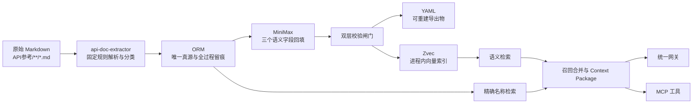
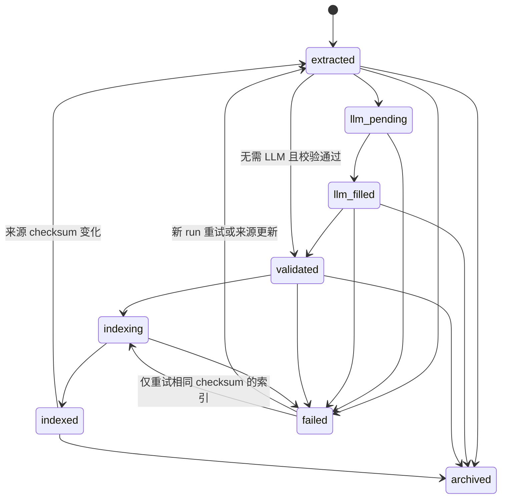

# RAG With Cold API Documents 架构设计（V2）

> 状态：已确认的目标架构  
> 更新日期：2026-07-27  
> 本版重点：ORM 覆盖提取全过程，修正稳定身份、失败数据、状态机与 Zvec 索引一致性。

## 1. 全景

一句话定义：**YAML 是可重建的导出物，ORM 是唯一真源；所有提取、校验、状态变更和索引操作都在 ORM 留痕；Coslab 提供工具能力，Zvec 承担进程内向量检索，网关与 MCP 共同对外服务。**

Zvec 是 in-process 向量库（不是独立服务），不引入网络/部署复杂度。代码 Agent 通过网关或 MCP 获取按版本和命名空间隔离的机器可消费上下文。



## 2. 架构原则与边界

### 2.1 核心原则

1. **ORM 真源**：业务状态只以 ORM 为准，YAML、dead-letter 文件和 Coze 索引都可由 ORM 重建。
2. **Version-first**：任何有效文档和任何召回结果必须携带明确版本。
3. **Namespace isolation**：精确检索和语义检索都必须先按 `namespace + version` 硬过滤。
4. **Machine-first**：返回参数契约、调用约束、反例、来源和版本，而不是面向人的 HTML 页面。
5. **全过程留痕**：任何写操作、状态变化、LLM 调用和校验结果均可追溯。
6. **幂等优先**：稳定身份与内容版本分离，重复运行不会生成重复实体。
7. **原文优先**：除三个指定语义字段外，提取过程不改写、不补全、不推断原文没有的事实。

### 2.2 工具边界

| 组件 | 定位 | 项目边界 |
|---|---|---|
| Coslab | 工具 | 只描述它提供的能力，不展开实现和实验过程 |
| Zvec | 进程内向量库 | `src/dao/emb/` 提供 Embedder ABC（云/本地）+ Zvec CollectionSchema + 写入/检索；ORM 是真源，Zvec 可由 ORM 重建 |
| MiniMax | LLM provider | `MiniMax-M2.7-highspeed` 用于批量回填，M3 用于精修 |
| YAML | 导出格式 | 不参与主流程判定，不作为更新输入的权威来源 |
| ORM | 事实与状态存储 | 承载提取、校验、审计、LLM 回填和索引全过程 |
| 网关 | 统一入口 | 负责鉴权、限流、路由和访问日志 |
| MCP | Agent 接口 | 将检索与 Context Package 封装为代码 Agent 可调用工具 |

## 3. 数据提取层

### 3.1 输入与解析方式

- 输入范围：`API参考/**/*.md`。
- 只处理 Markdown 文本，不做图片、OCR 或多模态解析。
- 固定归档结构、章节切分、表格、代码块、链接、来源和命名空间均使用 Python 规则解析，不调用 LLM。
- 只有需要语义理解的三个字段交给 MiniMax：`title`、`layman_explanation`、`constraints_summary`。
- 提取逻辑封装在 `api-doc-extractor` skill 中，以单进程脚本运行，不拆为独立服务。

### 3.2 支持的写入动作

提取层只暴露两个业务动作：

- `create`：首次发现稳定身份对应的文档。
- `update`：稳定身份已存在，但来源内容发生变化。

相同内容的重复运行是 `no-op`，不伪造一次 update；任务和校验仍可按运行策略留下检查记录。

### 3.3 文档分类

| 类别 | 判定 | ORM 落点 | 后续动作 |
|---|---|---|---|
| `standard` | 命中标准 API 章节结构 | `ApiDocument.content_kind=standard` | 回填、校验、导出、索引 |
| `non_standard` | 列表、索引、附录、概述或非标准正文 | `ApiDocument.content_kind=non_standard` | 按策略保留或跳过索引 |
| `failed` | 读取、解析、回填或校验失败 | `ApiDocument.extraction_status=failed`，同时写日志和报告 | 不进入有效导出与 Coze 索引，生成 dead-letter |

失败文档仍进入 ORM。这里的“不入库”统一解释为：**不进入有效数据集、不生成最终 YAML、不写入 Coze**，而不是不写 ORM。这样失败 chunk 也有稳定主实体，所有日志都能保持外键完整。

## 4. 稳定身份、内容版本与幂等规则

### 4.1 字段职责

- `chunk_id` 是稳定业务身份，由规范化来源定位符生成：优先使用 `source_url + source_node`，缺失时回退到 `source_path`；文档内容更新后保持不变。
- `checksum` 是规范化内容的摘要；内容变化时必须改变。
- `source_checksum` 可选，用于保存未经结构化处理的原始 Markdown 摘要，区分“原文变化”和“解析器输出变化”。
- checksum 的规范化算法和版本必须固定并记录，避免因为字段顺序或时间戳导致无意义更新。

`chunk_id` 必须在读取正文前就能生成，因此不能依赖成功解析后的 `name` 或 `namespace`。可另设由 `namespace + version + name` 组成的可读 `canonical_key` 并建立唯一约束，但它不是失败记录的主身份。

### 4.2 幂等决策

| 条件 | 动作 |
|---|---|
| `chunk_id` 不存在 | `create` |
| `chunk_id` 存在且 checksum 不同 | `update` |
| `chunk_id` 存在且 checksum 相同 | `no-op` |
| `chunk_id` 不同但 checksum 相同 | 记录重复内容告警，按配置保留或合并，禁止静默覆盖 |

`checksum` 不承担实体身份，也不能单独决定 update。数据库需要对 `chunk_id` 建主键或唯一约束，并为 checksum 建普通索引。

## 5. ORM 数据模型

MVP 保持六张核心表，不额外引入 staging 表。`ApiDocument` 同时是业务实体与处理中的聚合根，因此允许语义字段在流程完成前暂时为空。

### 5.1 `ApiDocument`

保存结构化 API 文档、来源元数据和当前处理状态。

关键字段：

- 身份：`chunk_id`、`name`、`namespace`、`version`、`language`、`category`。
- 语义字段：`title`、`layman_explanation`、`constraints_summary`。
- 原文字段：`product_support`、`description`、`signatures`、`params_md`、`returns`、`constraints_md`、`headers`、`examples`、`body_md`、`related`、`notes_md`、`raw`。
- 来源与分类：`source_path`、`source_url`、`source_node`、`content_kind`、`schema_version`。
- 幂等与索引：`checksum`、`source_checksum`、`coze_document_id`、`index_version`、`indexed_checksum`、`index_attempts`、`indexed_at`、`index_error`。
- 生命周期：`extraction_status`、`created_at`、`updated_at`、`archived_at`。

字段命名以现有 extractor 的 `layman_explanation` 为准，不再使用含义不明确的 `layman` 别名。

### 5.2 `IngestRun`

描述一次批量或单文件提取任务。

关键字段：`run_id`、`status`、`started_at`、`ended_at`、`worker_id`、`skill_version`、`parser_version`、`config_snapshot`、`total_count`、`ok_count`、`fail_count`、`end_reason`。

### 5.3 `ExtractionLog`

以追加方式记录每个 chunk 的阶段和状态变化，历史日志不可覆盖。

关键字段：`log_id`、`chunk_id`、`run_id`、`stage`、`from_status`、`to_status`、`attempt`、`error`、`duration_ms`、`created_at`。

### 5.4 `LlmFillJob`

记录每次 LLM 回填尝试及成本，不只保存最终成功调用。

关键字段：`job_id`、`chunk_id`、`run_id`、`status`、`attempt`、`provider`、`model`、`prompt_version`、`prompt_hash`、`input_tokens`、`output_tokens`、`cost`、`currency`、`latency_ms`、`error`、`started_at`、`ended_at`。

### 5.5 `ValidationReport`

保存双层校验的结构化结果。

关键字段：`report_id`、`chunk_id`、`run_id`、`layer`、`validator_version`、`passed`、`errors`（JSONB）、`warnings`（JSONB）、`validated_at`。

`layer` 取值为 `pre_publish` 或 `commit_sync`，避免“入库前”与 ORM 已留痕产生语义冲突。

### 5.6 `AuditEvent`

记录实体级写操作，用于回答谁在何时通过什么任务改变了什么数据。

关键字段：`event_id`、`run_id`、`entity_type`、`entity_id`、`action`、`actor`、`at`、`diff`（JSONB）、`correlation_id`。

`delete` 默认表示软删除：设置 `archived_at` 并保留数据。物理删除需要独立的受控维护流程。

### 5.7 三条铁律

1. 每个实体都有稳定 `chunk_id` 和内容 `checksum`；重复执行严格按幂等决策处理。
2. 任何 `create/update/delete` 都写 `AuditEvent`；`no-op` 不伪装成 update。
3. 任何状态变更都追加 `ExtractionLog`，LLM 调用和校验结果分别写专用表。

## 6. 状态机

`extraction_status` 同时表达当前流程阶段和可服务性，状态变化必须在同一数据库事务中写入 `ExtractionLog`。



状态含义：

| 状态 | 含义 |
|---|---|
| `extracted` | 规则解析完成，候选记录已写 ORM |
| `llm_pending` | 存在需要 MiniMax 回填的字段 |
| `llm_filled` | 三个语义字段已回填并通过响应格式检查 |
| `validated` | 双层校验通过，可导出并进入索引队列 |
| `indexing` | 已开始向 Coze 提交当前 checksum |
| `indexed` | Coze 已明确确认，且 `indexed_checksum == checksum` |
| `failed` | 当前 run 在某阶段失败；允许新 run 重试 |
| `archived` | 来源已删除或业务停用，不参与默认查询 |

禁止在 Coze 返回成功之前写 `indexed`。

## 7. 双层校验闸门

### 7.1 第一层：`pre_publish`

目标是判断候选文档是否具备进入有效数据集的资格。

- 自身完整性：必填字段、字段类型、枚举、稳定 `chunk_id`、checksum 重算一致。
- 命名约束：namespace 全小写、点分隔并包含明确版本。
- 关系一致性：`namespace ↔ version ↔ product_support ↔ language` 不冲突。
- 原文一致性：规则提取字段可追溯到原始 Markdown；LLM 字段不得包含原文之外的事实。
- 分类策略：`standard` 必须满足标准 API 最小字段集；`non_standard` 按配置决定是否可索引。

失败处理：

1. 更新 `ApiDocument.extraction_status=failed`。
2. 追加失败 `ExtractionLog`。
3. 写入未通过的 `ValidationReport`。
4. 从 ORM 当前状态生成 dead-letter YAML/JSON。
5. 不生成最终 YAML，不进入 Coze。

### 7.2 第二层：`commit_sync`

目标是保证 ORM、来源目录、导出物和索引任务之间的一致性。

- 复核解析阶段记录的 create/update/no-op 决策与当前 `chunk_id + checksum` 快照一致，防止校验期间被并发任务覆盖。
- 检查同 checksum 的跨 chunk 重复内容并记录告警。
- 同步来源目录；来源消失时只软删除并设置 `archived_at`。
- 写通过的 `ValidationReport` 和相应 `AuditEvent`。
- 事务提交成功后，从 ORM 生成最终 YAML。
- 将 `validated` 文档提交给 Coze 索引流程。

目录同步不能直接物理删除数据或导出物。孤儿文件先归档，确认不再被引用后再由维护任务清理。

## 8. 端到端摄取流程

```text
原始 Markdown（API参考/**/*.md）
  ↓
创建 IngestRun
  ↓
[Skill 固定规则解析与分类]
  ├─ 计算稳定 chunk_id、source_checksum、checksum
  ├─ create / update / no-op ApiDocument
  ├─ 写 AuditEvent（有数据变化时）
  └─ 写 ExtractionLog(extracted / llm_pending / failed)
  ↓
[MiniMax LLM 回填]
  ├─ 更新 title / layman_explanation / constraints_summary
  ├─ 写 LlmFillJob（每次尝试）
  └─ 写 ExtractionLog(llm_filled / failed)
  ↓
[第一层 pre_publish 校验]
  ├─ 完整性、类型、namespace/version、关系和事实一致性
  ├─ 写 ValidationReport
  └─ 失败 → ORM 标记 failed + dead-letter，不导出、不索引
  ↓
[第二层 commit_sync 校验]
  ├─ 复核幂等决策、重复检查、目录同步和软删除
  ├─ 写 ValidationReport + AuditEvent + ExtractionLog(validated)
  └─ 数据库事务提交后，从 ORM 导出 YAML
  ↓
[Coze 索引]
  ├─ 提交 title/摘要/约束向量字段与过滤元数据
  ├─ 成功 → 记录 Coze ID、indexed_checksum、indexed_at，状态 indexed
  └─ 失败 → 保存 index_error，状态 failed，可重试
```

ORM 写入与审计/状态日志应处于同一数据库事务。YAML 和 Coze 都是事务外副作用，失败时由 ORM 状态驱动重试，不能反向覆盖 ORM。

## 9. YAML 与 dead-letter

### 9.1 YAML 导出

- 只从 `validated` 或 `indexed` 的 ORM 记录生成。
- 输出内容不包含运行时生成的时间戳，以保证相同内容可重复生成相同文件。
- 输出路径由稳定来源路径映射，不以 LLM 返回内容决定。
- YAML 修改不会自动回写 ORM；需要修改数据时必须通过受审计的 ORM 更新流程。

### 9.2 Dead-letter

- dead-letter 也是 ORM 状态的导出视图，不是真源。
- 至少包含 `chunk_id`、`run_id`、失败阶段、错误码、来源路径、checksum 和时间。
- 重试成功后保留历史失败记录；当前 dead-letter 文件可移入归档区，不能删除 ORM 历史。

## 10. Zvec 索引一致性

### 10.1 写入顺序

```text
ORM 提交 validated
→ 状态改为 indexing 并追加日志
→ src/dao/emb/indexer.upsert_batch() 写入 Zvec collection
→ 调 coll.optimize() 后台建 HNSW 索引
→ 状态改为 indexed 并追加日志
```

Zvec 设计上：写入先到 flat buffer，调 `optimize()` 后台建索引（不阻塞读写）。
MVP 不再保留 `coze_document_id` 字段（已迁移到 `indexed_zvec_collection` 路径 + `indexed_at` 时间戳）。

### 10.2 MVP 与演进

MVP 使用 `ApiDocument` 的索引状态字段配合 `ExtractionLog` 扫描重试，不增加第七张表。吞吐或可靠性要求提升后，再通过 ADR 决定是否引入 outbox/index job 表。

### 10.3 索引负载（Zvec CollectionSchema）

详见 `src/dao/emb/schema.py`，字段分三类：

- **🔑 元信息字段（必建倒排索引）**：`namespace` / `api_id` / `name` / `version` / `kind` / `language` / `version_support` / `deprecated`
- **🕓 生命周期**：`ingested_at`（INT64，范围过滤）
- **📦 载荷字段（不建索引）**：`api_name` / `description` / `signature` / `parameters_md` / `returns_json` / `examples` / `source_markdown` / `deprecation_note`
- **🎯 向量字段**：`dense_embedding`（VECTOR_FP32，默认 2560 维）/ `sparse_embedding`（SPARSE_VECTOR_FP32）

向量文本构造规则（`src/dao/emb/indexer.py:_attach_vectors`）：
- dense 输入：`description + api_name + name`
- sparse 输入：`api_id + signature + name`

召回时 `src/dao/emb/searcher.py:search()` 同时走 dense + sparse 双路，结果用 RRF（k=60）合流。`search_by_name()` 是短路精确匹配，不调 embedder。

## 11. 检索层

### 11.1 双通道

| 通道 | 触发方式 | 数据源 | 召回 | 返回 |
|---|---|---|---|---|
| 函数名字检索 | 规范化后的精确 token/符号匹配 | ORM 名称索引 | Top 3 | 短卡片：签名、版本、一句话、来源 |
| 函数意义检索 | 用户意图或自然语言语义匹配 | Coze 向量库 | Top K | 完整候选，供 Context Package 加工 |

精确函数名检索不依赖向量库，避免短 token、符号名、大小写和重载函数召回不稳定。

### 11.2 合并与重排规则

1. 查询必须带 `namespace + version`；缺失时先解析或要求调用方补齐，禁止跨命名空间盲召回。
2. 两路结果按 `chunk_id` 去重。
3. 硬过滤归档记录和 `indexed_checksum != checksum` 的陈旧索引。
4. 同名不同版本时版本匹配优先，不允许旧版本高相似度覆盖目标版本。
5. 候选分数接近时输出差异卡，比较语义、签名、参数、返回、约束、版本和适用场景。
6. 召回结果经 LLM 加工为 Context Package，但不得增加源文档没有的 API 事实。

### 11.3 Context Package 最小结构

- 查询意图和目标 `namespace/version`。
- 候选 `chunk_id/name`、签名、参数契约、返回值和约束。
- 候选差异与选择理由。
- 来源 URL/path、schema version、checksum 和召回通道。
- 相关反例、弃用或归档信息。

## 12. 上层封装与可观测性

### 12.1 网关

网关是 HTTP/API 的统一入口，负责：

- 鉴权与租户/命名空间授权；
- 限流、超时和路由；
- 请求关联 ID 与访问日志；
- 检索和 Context Package 接口的稳定版本化。

### 12.2 MCP

MCP 面向代码 Agent，至少封装：

- 按函数名检索短卡片；
- 按语义检索完整 Context Package；
- 查询指定 chunk 的版本、来源和参数契约；
- 在候选接近时获取差异卡。

### 12.3 Trace

对外请求保留五阶段 Trace：

```text
trigger → recall → rerank → inject → generate
```

摄取留痕与查询 Trace 分工不同：六张 ORM 表覆盖摄取与索引全过程，五阶段 Trace 覆盖在线检索和生成全过程。二者通过 `chunk_id`、checksum、correlation ID 和 context package ID 关联。

## 13. 事务、并发与错误处理

- 单个 chunk 的实体更新、`AuditEvent` 和 `ExtractionLog` 必须在同一事务提交。
- 使用数据库唯一约束和乐观并发字段防止多 worker 重复创建或覆盖新内容。
- 批次失败不回滚其他已完成 chunk；`IngestRun` 汇总成功、失败和重试统计。
- 外部调用不持有长数据库事务；调用前后分别提交状态。
- 错误字段保存稳定错误码和脱敏后的摘要，禁止记录密钥、完整 prompt 或敏感原文。
- 所有重试记录 attempt 和上一次错误，禁止无上限重试。

## 14. 代码落点

目标实现顺序与文件职责如下：

1. `core/models.py`：SQLModel 六表、枚举、约束和状态字段。
2. `core/database.py`：engine、session factory 与事务边界；不在运行时脚本中隐式改 schema。
3. `migrations/`：使用 Alembic 管理数据库迁移。
4. `ingest/scripts/ingest.py`：规则解析、分类、幂等 upsert、双层校验、审计、YAML 导出和索引调度。
5. `ingest/skills/api-doc-extractor/`：保留确定性提取规则和 MiniMax 回填协议。

现有直接读写 YAML 的脚本属于过渡实现；迁移完成后，YAML 写入必须改为从 ORM 导出。

## 15. 已确认决策与待演进项

### 15.1 已确认

- ORM 是唯一真源，覆盖失败数据与提取全过程。
- YAML 和 dead-letter 都是可重建导出物。
- `chunk_id` 是稳定身份，checksum 是内容版本。
- 失败数据保留在 ORM，但不进入有效导出和 Coze。
- `indexed` 只能在 Coze 明确成功后写入。
- MVP 使用六张核心表，不增加 staging/outbox 表。
- 精确名称检索走 ORM，语义检索走 Coze。

### 15.2 后续通过 ADR 决定

- 是否在规模提升后增加 outbox/index job 表。
- `non_standard` 内容的默认索引策略。
- checksum 规范化算法及版本升级策略。
- Coze 幂等写入、删除和远端状态核对接口的具体适配方式。
- 数据库选型、部署拓扑和租户隔离级别。
