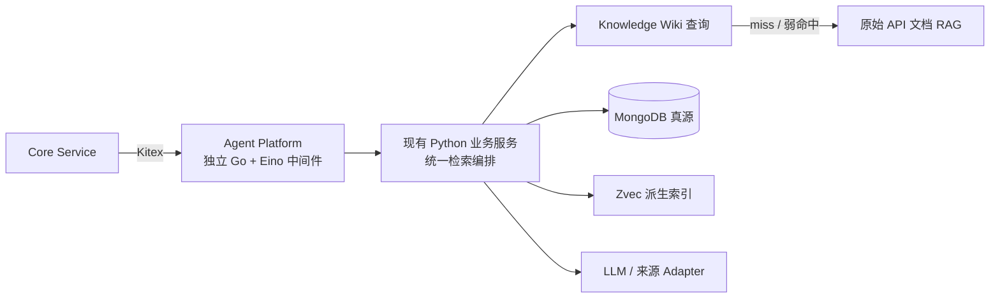

# ADR-0001：Agent 中台能力分类、v1 白名单与调用边界

- 状态：已接受
- 日期：2026-08-06
- 决策范围：任务 2–10 的前置约束；本文只定义契约和边界，不实现 SDK、注册表、Kitex 适配器或业务逻辑。

## 背景与事实基线

Third Brain 不是单一的 Agent Runtime。当前可独立运行或组合的业务链路是：原始 API 文档
RAG、Knowledge Wiki、文档构建/同步、关系图与 Benchmark。MongoDB 是文档事实、发布状态和
查询留痕的持久化归属；Zvec 是进程内、可由 MongoDB 重建的派生索引；Redis 仅用于热力图等
旁路计数。它们均不是 Agent 中台的数据库。

当前仓库尚未实现 Go、Eino、Kitex 或 `agent-platform/`。本 ADR 将它们定义为目标态的 Agent
中间件：上游 Core Service 通过 Kitex 调用 Agent Platform，Platform 再调用现有 Python 业务
服务。不能反向描述为现有 Python/FastAPI 调用链已经依赖的组件。

术语约定：

- **能力**：具有稳定 ID、输入/输出契约、版本和准入策略的业务动作；不等同于一个 HTTP 路由或
  一个 CLI 命令。
- **在线**：由一次 Agent 请求在 deadline 内同步得到结果；v1 不引入异步任务队列、任务表或
  状态查询 API。
- **受控离线**：只能由显式运维/调度工作流启动，允许长耗时和写入；不能由在线 Agent 请求
  自动触发。
- **Agent Platform**：独立部署的 Go + Eino 中间件；接收 Core 的 Kitex 请求，执行 Agent
  编排、静态能力准入、deadline/cancel、脱敏和 trace，再调用 Python 业务服务。它不读取数据。
- **Python 业务服务**：拥有检索、摄取、Knowledge、编译和 Benchmark 的业务规则与全部数据
  依赖；MongoDB、Zvec、Redis、LLM 和来源 Adapter 均只归此层访问。

## 决策

### 1. 五类能力与稳定 ID

能力 ID 不复用 HTTP URL 或 Python 符号，统一采用
`thirdbrain.<domain>.<action>.v<major>`；`v1` 的契约版本从 `1.0.0` 开始，采用 SemVer。
每个能力的业务 schema 另有独立版本，不由 Kitex IDL 包版本替代。

| 稳定 ID | 所属模块 / 当前实现 | 调用与时长 | 数据风险 | 输入 / 输出契约责任方 | v1 状态与版本策略 |
|---|---|---|---|---|---|
| `thirdbrain.api-doc-rag.retrieve.v1` | `src/service/agent_query_service.py`、`src/gateway/router.py`、`src/dao/emb/` | 在线、同步、短请求；名称或语义检索 | 业务数据只读；成功查询会 best-effort 写 Mongo 查询快照，且可写 Redis 热力图   | `src.gateway.schemas` 与 service command 是领域契约责任方；调用者必须提供精确 `namespace + version` | **Python 内部检索能力**。主要供 Wiki miss 时补充原始资料；不作为 Core → Platform 的默认 Kitex API，保留现有 `/api/v1/agent/query/*` 契约 |
| `thirdbrain.document.ingest.v1` | `src/service/rag_construction_service.py`、`src/doc_sync/`、`src/script/ingest.py` | 受控离线；提取、转换、索引可能长耗时 | 可访问来源白名单、调用转换/embedding provider、写 Zvec；YAML 管理导入另写 Mongo | RAG construction request/artifact schema、Profile schema 和来源配置分别由现有 Python 模块负责 | **白名单：仅受控离线**。在线 Agent 不可路由；每个 Profile/schema 独立版本化 |
| `thirdbrain.knowledge-wiki.compile.v1` | `src/knowledge/service.py`、`src/gateway/knowledge_update_router.py`、`src/cli/knowledge.py` | 受控离线、可长耗时；LLM 提取、校验、发布、索引刷新 | 高影响写：Mongo Source/Artifact/Catalog、Knowledge Zvec；调用 LLM provider | `WikiUpdateInput`、`UpdateOptions`、`UpdateResult` 由 `src.knowledge` 负责 | **白名单：仅受控离线**。保留 compiler fingerprint（extractor/prompt/model/schema）作为可复现版本；不得由中台直接拼装数据库写入 |
| `thirdbrain.knowledge-rag.orchestrate.v1` | `src/retrieve/pipeline.py`、`src/gateway/retrieval_router.py` | 在线、同步、短请求；先查 Wiki，再确定性 fallback 原始 RAG，融合并构造 Recall Capsule | 数据读；现有 HTTP 的 `update_wiki=true` 可调度一次编译写入 | `QueryKnowledgeOptions`、`QueryKnowledgeResult`、`RetrievalQueryRequest` 由 `src.knowledge`/`src.retrieve` 负责 | **Core → Platform 唯一在线 Kitex API 的下游 Python 能力**。Platform 不暴露 `update_wiki`，调用 Python 时固定为 `false`；现有 HTTP 保持原行为和参数兼容 |
| `thirdbrain.pipeline-benchmark.run.v1` | `Skill/pipeline/`、`src/script/`、`benchmark/` | 离线、批量、长耗时、可重试 | 可能读写本地工作目录、调用网络/LLM、写索引或生成评测制品 | 每个 Skill 的 `SKILL.md`、CLI 参数和 Benchmark case/schema 各自负责 | **延期，不可路由**。只登记元数据和产物版本；在具备隔离执行、审批、可复现工件协议前，不向 Eino Agent 暴露 |

说明：原始 API 文档 RAG 不是默认 Agent 路径，但仍是 Knowledge miss 的确定性 fallback 和
兼容的直接查询能力，不能因“通常不调用”而移除。独立 Knowledge 查询则只读已发布 Wiki，
不会回退原始 RAG；二者不能混同。

### 2. Agent Platform v1 准入白名单

这里的白名单严格指：**Core Service 可以通过 Kitex 请求 Agent Platform 执行什么，以及
Platform 被允许调用哪个 Python 业务能力。** 它不等于项目中所有已存在的功能。

| 准入结果 | Core → Platform（Kitex） | Platform → Python | 原因 |
|---|---|---|---|
| **允许：唯一在线链路** | `QueryKnowledgeWithRagFallback` | `thirdbrain.knowledge-rag.orchestrate.v1`，且 `update_wiki=false` | Core 请求统一上下文；Python 先查 Wiki，弱命中或 miss 时内部调用原始 API RAG；Go 不参与检索或取数 |
| **不单独暴露** | — | `thirdbrain.api-doc-rag.retrieve.v1` | 原始 API 文档检索仍存在，但只作为上述 Python 编排的 fallback，以及既有直接 HTTP 查询；不让 Core 经 Platform 默认直调 |
| **不允许在线调用** | — | `thirdbrain.document.ingest.v1` | 摄取会访问来源、调用转换/embedding 并写 Zvec/Mongo；只能继续由 Python 侧运维/调度/CLI 或管理 HTTP 发起 |
| **不允许在线调用** | — | `thirdbrain.knowledge-wiki.compile.v1` | 编译会调用 LLM、写 Knowledge Catalog/Zvec；只能继续由 Python 侧运维/调度/CLI 或管理 HTTP 发起 |
| **延期，不接入 Platform** | — | `thirdbrain.pipeline-benchmark.run.v1` | Pipeline Skill 与 Benchmark 继续由 CLI/CI/人工流程运行，不能由 Core 经 Platform 发起 |

关系图读写、YAML → Mongo 管理导入、热力图、前端展示等不构成第六个 Agent Platform API。
它们继续由既有 HTTP/CLI 或 Python 内部使用；后续若有真实 Agent 用例，必须新建 ADR，并完成
数据风险、准入和版本设计后才能加入白名单。

### 3. API 与 Kitex 目标态

Agent Platform 对 Core 只提供一个逻辑上的 `CapabilityGateway`，以 Kitex 作为 Core →
Platform 的信息交换方式。其传输包命名为 `thirdbrain.agentplatform.capability.v1`；实际 IDL
与生成代码是后续任务，不在本 ADR 实现。Platform 到 Python 业务服务沿用后续适配器选定的
稳定进程间或网络契约；Go 不直接访问任何数据依赖。

每次调用的最小信封必须包含：

| 字段 | 责任 |
|---|---|
| `capability_id`、`capability_version`、`request_schema_version` | Platform 在接收 Core 请求时校验静态登记与兼容性 |
| `caller_service`、`correlation_id`、`deadline` | Core 提供，Platform 向 Python 传播；不伪造用户、租户或 SSO 身份 |
| 强类型 request / response payload | Python 领域模块拥有；Platform 不得将其解释为业务规则或通用 JSON 数据库 |
| 标准错误码、retryable、trace context | Platform 归一、脱敏并记录 OpenTelemetry span；业务错误码的含义由 Python 领域模块拥有 |

`CapabilityGateway` 不采用“任意 JSON / bytes + 任意 capability ID”的万能调用接口。v1 的
Kitex IDL 必须将可在线路由的 request/response 编译为显式、封闭的 `oneof` 分支；未登记 ID
或不在该分支中的 payload 在 Platform 调用 Python 前拒绝。目标 RPC 形状如下：

| Kitex RPC（Core → Platform，目标态） | Platform 调用的 Python 能力 | 必填请求字段 | 稳定响应 | 特殊限制 |
|---|---|---|---|---|
| `QueryKnowledgeWithRagFallback` | `thirdbrain.knowledge-rag.orchestrate.v1` | `query`、`wiki_id`、`namespace`、`version`；可选 collection、language、budget、关系扩展参数 | `QueryKnowledgeResult` 对应的 Recall Capsule、命中、abstention、trace | Platform 不取数；Python 内部完成 Wiki → 原始 RAG fallback。Kitex IDL 中**没有** `update_wiki`，Platform 调 Python 时固定传 `false` |

原始 RAG、摄取、Knowledge 编译、Pipeline 与 Benchmark 在 v1 均没有 Core → Platform 的 Kitex
RPC。它们分别继续使用当前受控的 Python 内部调用、CLI、HTTP、CI 和制品 schema；不能由
Core 借 Agent Platform 发起。

Kitex 只出现在下列新路径中：

Platform 到 Python 的适配器只能完成传输转换、进程生命周期、健康检查和错误边界转换；不得
复制检索、RRF、版本过滤、文档解析、证据验证、发布或索引业务逻辑。Agent Platform 不得直接
连接 MongoDB、Zvec、Redis、LLM provider 或来源站点。

### 4. 既有调用兼容矩阵

“不处理 CLI、Knowledge/Retrieval HTTP 信息”的精确定义是：这些既有调用不穿过
`CapabilityGateway`，中台不代理、不改写其请求或响应，也不替代其鉴权。Kitex 不是 FastAPI
或 CLI 的替代传输。

| 既有入口 / 调用方 | 当前入口 | v1 后的路径 | 是否经过 Kitex | 兼容承诺 |
|---|---|---|---|---|
| 原始 API 文档 HTTP | `POST /api/v1/agent/query/once|batch` | 继续 FastAPI → Python service | 否 | URL、Pydantic schema、查询快照语义不变 |
| Knowledge 只读 HTTP | `POST /api/v1/knowledge/query` | 继续 FastAPI → Knowledge service | 否 | 仍只读 Wiki，仍不 fallback 原始 RAG |
| Knowledge 编译 HTTP | `POST /api/v1/knowledge/update` | 继续 FastAPI → Knowledge service | 否 | 保留独立写入面、现有认证和同步响应 |
| Wiki + 原始 RAG HTTP | `POST /api/v1/retrieval/query` | 继续 FastAPI → RetrievalPipelineService | 否 | 保留 `update_wiki` 兼容参数；仅中台路径固定为 false |
| RAG 构建 / YAML 管理 HTTP | `/api/v1/admin/rag-construction/*`、`/api/v1/admin/yaml-imports/batch` | 继续 FastAPI → Python service | 否 | 不被中台接管；仍由部署侧提供上游防护 |
| 维护 CLI | `src/cli/*`、`src/script/*` | 直接 Python/文件/既有依赖 | 否 | 参数、文件制品和退出码不因中台改变 |
| Pipeline Skill / Benchmark | `Skill/pipeline/*`、`benchmark/*` | 直接 CLI/CI/人工流程 | 否 | 仍离线运行；不成为在线 Agent tool |
| 内部 Python 调用 | 各领域 service/Protocol | 保持直接函数/Protocol 调用 | 否 | 不要求迁移到 Kitex；未来适配器只调用公开领域端口 |
| Core → Agent Platform | 新增目标态 | Core → Kitex → Agent Platform → Python 统一检索编排 | Core → Platform 段是 | Core 只能请求 `QueryKnowledgeWithRagFallback`；Platform 不改写既有 CLI/HTTP |

### 5. 网关权限与依赖归属

本 ADR 优先定义 gateway 准入，不设计 MongoDB/Zvec 的底层 ACL。

| 层级 | 当前事实 | v1 归属与边界 |
|---|---|---|
| 原始 RAG HTTP | 当前无内置服务密钥，需受控网络或上游网关 | 保持既有事实；中台不接管、也不以此推断公网可用 |
| Knowledge / Retrieval HTTP | `KNOWLEDGE_API_KEY` 的 Bearer 或 `X-API-Key` | 保持既有鉴权；中台不转发或重解释最终用户凭证 |
| 构建和 YAML 管理 HTTP | 当前代码无路由级鉴权，部署需加上游防护 | 保持原样；归为受控离线，不经在线 Agent 路由 |
| Agent Platform Gateway | 尚未实现 | 私有部署边界；只接受已配置的 Core Service，且只允许 `QueryKnowledgeWithRagFallback`；v1 无公网承诺、多租户、用户 SSO、RBAC/ABAC 或凭证委派 |
| MongoDB | Catalog、Knowledge revision、查询记录、关系图等事实与审计归属 | Python 业务服务拥有 collection、schema 和连接；Agent Platform 不直接连接；底层数据库权限不在本 ADR 范围 |
| Zvec | API RAG 与 Knowledge 的独立派生索引 | Python 领域模块拥有；Agent Platform 不读写索引文件 |
| Redis、LLM、来源 Adapter | Redis 为旁路计数；LLM/来源 Adapter 属于 Python 领域执行依赖 | 不暴露为 Agent tool，不交由 Agent Platform 任意访问或持有密钥 |

### 6. 版本、兼容与可观测性

1. capability ID 的 `v1` 只在破坏性业务契约变化时升级；小版本仅增加向后兼容字段或能力
   元数据。
2. 业务 request/response schema、RAG Profile schema、Knowledge compiler fingerprint 和
   Kitex IDL package 分别版本化。任一版本变化不能被另一个版本“隐式代表”。
3. 静态声明须记录：ID、分类、输入/输出 schema 及兼容范围、超时上限、准入等级、脱敏字段、
   依赖、所有者和是否允许 online route。版本不兼容即拒绝路由。
4. Agent Platform 只生成/传播 trace、deadline、cancel 和脱敏结构化日志；不新增独立 trace
   数据库，也不获取数据。Mongo 事实、查询记录和 Benchmark 工件仍归 Python 领域模块。
5. v1 对 B/C 级能力不提供 job ID、排队、持久化状态或跨重启恢复 API；需要这些能力时必须
   另立 ADR，不能借“中台”隐式引入数据库或队列。

## 明确非目标

- 不把项目重构为单一 Agent Runtime，也不让 Go/Eino 替代或直接访问 Python 领域服务的数据依赖。
- 不新增独立数据库、向量库、消息队列、任务调度持久层或工作流状态库。
- 不承诺公网暴露、多租户隔离、SSO、用户授权委派或底层存储 ACL。
- 不修改既有 CLI、FastAPI URL、Pydantic schema、Mongo/Zvec 数据模型或业务逻辑。
- 不把 Pipeline Skill、Benchmark、任意文件访问、网络访问或密钥访问开放给在线 Agent。

## 后续任务必须引用的结论

1. 后续设计使用“**统一能力调用层**”，不用“统一 Agent Runtime”。
2. 后续设计使用“**中台不新增独立数据库；项目仍以 MongoDB 为事实存储、Zvec 为派生索引**”，
   不用“整个项目零数据库”。
3. v1 中 Core 经 Kitex 仅可请求 Agent Platform 的 `QueryKnowledgeWithRagFallback`；Platform
   调用 Python 统一检索编排时必须保持 `update_wiki=false`，由 Python 内部完成 Wiki → 原始 RAG fallback。
4. 原始 RAG、摄取、Knowledge 编译、Pipeline 与 Benchmark 的原有 CLI/HTTP/CI 路径继续存在，
   但不经 Core → Agent Platform 的 Kitex 调用。
