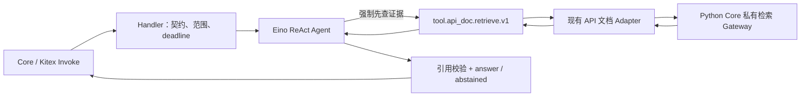

# ADR-0002：API 文档能力由 Eino Agent 提供服务

- 状态：已接受
- 日期：2026-08-11
- 范围：`agent-platform` 的 `cap.api_doc.agent.v1`

## 背景

原来的 API 文档能力由 Kitex Handler 直接调用检索适配器。这样做虽然链路短，但 Handler
同时承担了协议解析、检索调用和结果返回，后续无法自然加入工具白名单、模型校验、引用和
“查不到就不回答”等 Agent 行为。

## 决策

Kitex 仍然是外部传输协议，但 `Invoke` 不再直接持有或调用检索适配器。请求进入
`internal/agent.Service` 后，由 Eino ReAct Agent 负责一次受控的 API 文档问答：

对外能力 ID 为 `cap.api_doc.agent.v1`。旧的 `cap.api_doc.retrieval.v1` 只作为兼容别名接收，
不再作为主要发现结果。

## 约束

1. Handler 只做 envelope 校验、超时和错误归一，不访问 Adapter、MongoDB、Zvec 或来源站点。
2. Agent 的工具集合是静态白名单，目前只有 `tool.api_doc.retrieve.v1`。
3. Agent 每次请求最多调用一次检索工具；工具参数中的 `wiki_id`、`namespace`、`version`
   由已验证的请求范围覆盖，模型不能自行改变版本边界。
4. 检索结果必须经过 Adapter 的来源路径、分数、摘要和计数校验。没有可信命中时返回
   `abstained`，禁止用模型常识补写 API 事实。
5. LLM 只通过 OpenAI-compatible 配置接入 Eino；未配置模型时服务可以启动，但在线 Agent
   Invoke 返回 `CAPABILITY_UNAVAILABLE`，绝不回退到 Handler 直连 Adapter。
6. 调用 ID、trace ID、deadline/cancel 由统一入口传入 Agent 和工具；业务 Agent 不实现重试、
   密钥透传或任意网络访问。

## 结果

- 传输层、Agent 编排层和检索数据层职责分开，新增工具或能力时不会把数据访问重新塞回 Handler。
- 输出统一为 `completed`、`abstained` 或 `failed`，并携带可信引用、工具调用数、耗时和 trace ID。
- `ExecuteKnowledgeAssist` 继续保留，给现有 Core 业务提供兼容的确定性上下文包；它不改变新的
  API 文档 Agent 边界。
