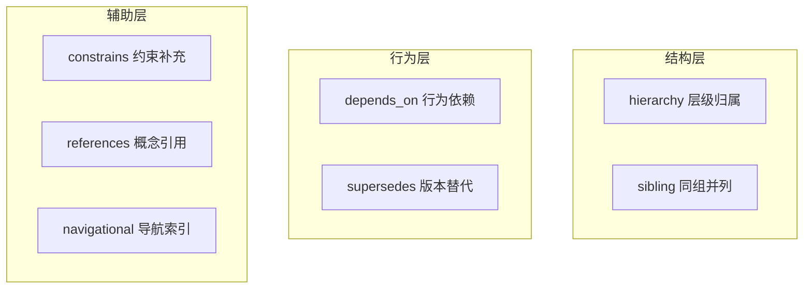

# API 文档关系建模设计

> 状态：已确认（V1 草案）
> 更新日期：2026-07-31
> 适用版本：Schema V2 起
> 关联文档：`docs/architecture.md` · `AGENTS.md`（PRD P1–P4）

本文定义 `API参考/**/*.md` 内部链接的**抽象关系模型**，覆盖关系类型分类与关系强度评估两套正交体系，并落到 Schema V2 字段与 5 阶段 Trace 的具体接入点。

## 1. 设计目标

- **把 URL 升级为关系对象**：当前 `related: list[str]` 仅存 URL/锚点，无法被机器用于召回重排。
- **两轴正交**：关系类型（语义）↔ 关系强度（价值），独立演化、独立落库。
- **Machine-first**：每条关系必须带 `target_chunk_id`、`evidence`、`position` 等机器可消费字段（对齐 PRD P3）。
- **Version + Namespace 硬约束**：跨版本/跨命名空间的关系只入参考文本，不入图（对齐 PRD P1/P2）。
- **可解释召回**：强度分数要拆成可独立计算的子维度，方便 trace 阶段归因（对齐 PRD P4）。

## 2. 设计原则

| 原则 | 含义 | 落点 |
|---|---|---|
| **类型与强度解耦** | 一种类型在不同上下文强度差异很大，不预先绑死 | `relation_type` 与 `strength_tier/score` 独立字段 |
| **离散 + 连续并存** | 离散等级做硬过滤，连续分数做精排 | 4 级 `strength_tier` + 0-1 `strength_score` |
| **规则层与 LLM 层分离** | 能规则算的别让 LLM 算，能批处理的不阻塞主流程 | 5 维打分中 3 维规则、2 维 LLM |
| **方向性显式建模** | `depends_on` / `supersedes` 有向；`sibling` / `references` 无向 | `direction: directed \| undirected` |
| **证据可追溯** | 每条关系必须能指出"为什么这条边存在" | `evidence` 字段存原文片段或锚点 |

## 3. 关系类型分类

按 AscendC 实际语料归纳为 **7 种类型，3 个层级**。命名遵循语义/动词，而非表层链接形态（是否在表格、是否为锚点链接都不决定类型）。

### 3.1 全景



| 层 | 类型 | 召回价值 | 触发器（链接上下文关键词） |
|---|---|---|---|
| 结构 | `hierarchy` | 默认召回，补全上下文 | "父主题"、"子主题"、面包屑 |
| 结构 | `sibling` | 默认召回，备选方案 | 列表/索引页、表格横向对比 |
| 行为 | `depends_on` | 必召回，缺则视为召回失败 | "必须"、"配合使用"、"先调用" |
| 行为 | `supersedes` | 必召回，避免给出过期 API | "区别是"、"已废弃"、"替代为"、改名表 |
| 辅助 | `constrains` | 条件召回（query 关心约束时） | "取值范围"、"参见[表 N]"、"约束" |
| 辅助 | `references` | 条件召回（query 关心概念时） | "概念"、"定义"、"具体说明" |
| 辅助 | `navigational` | 默认不召回 | 页脚、面包屑、附录跳转、法律链接 |

### 3.2 类型判定规则

每种类型都有可独立判定的触发器，**优先走规则层，规则不确定才退化到 LLM**。

| 类型 | 规则触发器 | 退化到 LLM 的条件 |
|---|---|---|
| `hierarchy` | 锚点文本含"父主题/子主题/上一节/下一节" | 链接位于面包屑结构但无显式文本 |
| `sibling` | 位于列表/索引页的表格行；或同分类下多个 API 互引 | 同一段落出现 ≥3 个 API 名称但无表头 |
| `depends_on` | 前后 64 字符内出现"配合使用/必须先/需要/依赖" | 仅有调用顺序暗示，无显式关键词 |
| `supersedes` | 链接前后 128 字符内出现"区别是/已废弃/替代/新接口名"；或位于"接口变更说明"文档 | 仅链接文本是新旧 API 名，无文字说明 |
| `constrains` | 锚点含 `#table`/`#li` 锚点；或前后 64 字符内出现"取值范围/约束/限制" | 链接位于参数说明段但语义模糊 |
| `references` | 锚点文本是概念短语而非 API 名（如"多核控制"、"硬同步"） | 锚点文本是 API 名但上下文是解释性段落 |
| `navigational` | URL 含 `/legal/`、`/cookies`、`/privacy`；或位于 Markdown 最后 200 字符内 | — |

> 规则层判定必须输出 `confidence: 0.0-1.0`；`confidence < 0.7` 时强制走 LLM 复核。

## 4. 关系强度评估

强度回答"这条关系对 RAG 召回有多大价值"。**4 级离散 + 1 个 0-1 连续分数** 同时落库，离散做硬过滤、连续做精排。

### 4.1 强度等级

| 等级 | 分数区间 | 绑定类型 | 召回策略 |
|---|---|---|---|
| **Strong 强** | 0.80–1.00 | `depends_on`、`supersedes` | 必召回；缺则视为召回失败 |
| **Moderate 较强** | 0.50–0.80 | `hierarchy`、`sibling` | 默认召回，补全上下文 |
| **Weak 中等** | 0.20–0.50 | `constrains`、`references` | 条件召回：query 命中约束/概念关键词时召回 |
| **Negligible 弱** | 0.00–0.20 | `navigational` | 默认不召回，特殊 query 才召回 |

**绑定不是强约束**：`sibling` 关系若出现在 API 列表页（典型场景），可上浮到 `Strong`；`navigational` 关系若出现在主体段落（非页脚）可上浮到 `Weak`。最终 `strength_tier` 由 4.2 公式计算后离散化得到。

### 4.2 强度分数（5 维加权）

```
strength_score = 0.35·w_position
               + 0.25·w_target
               + 0.20·w_bidirection
               + 0.15·w_evidence
               + 0.05·w_density
```

| 维度 | 权重 | 取值表 | 实现层 |
|---|---|---|---|
| `w_position` | 0.35 | 功能说明/参数说明=1.0；约束/示例=0.7；表格说明=0.5；标题/页脚=0.2 | LLM |
| `w_target` | 0.25 | 标准 API 实体=1.0；标准概念/章节=0.7；列表/索引页=0.4；外部页/页脚=0.1 | 规则 |
| `w_bidirection` | 0.20 | A↔B 双向=1.0；仅 A→B=0.5；单向且无反向=0.3 | 规则 |
| `w_evidence` | 0.15 | "区别是/配合使用/可选"等强信号=1.0；裸链接=0.5；模板页脚=0.1 | LLM |
| `w_density` | 0.05 | 同对关系出现 ≥3 次=1.0；2 次=0.7；1 次=0.4 | 规则 |

> **离散化映射**：`score ≥ 0.8 → Strong`；`0.5 ≤ score < 0.8 → Moderate`；`0.2 ≤ score < 0.5 → Weak`；`score < 0.2 → Negligible`。

### 4.3 维度实现说明

- **`w_position` 与 `w_evidence` 需 LLM 介入**（看上下文语义），异步批处理，不阻塞主流程。
- **`w_target` / `w_bidirection` / `w_density` 走纯规则**：
  - `w_target`：基于目标文档的 `content_kind`（`standard` / `non_standard` / `failed`）。
  - `w_bidirection`：建图阶段做一次反向边扫描。
  - `w_density`：对每对 `(source_chunk_id, target_chunk_id)` 聚合计数。
- **分数版本化**：每次打分逻辑变更必须 bump `strength_score_version` 字段，避免历史 trace 误读（对齐 PRD P5 长期 Benchmark 可回归）。

## 5. Schema 落点

现有 `related: list[str]` 是空架子。引入新字段 `relations` 保留结构化对象，**旧 `related` 字段保留做兼容**。

### 5.1 字段定义

```yaml
relations:
  - target_chunk_id: com.huawei.cann.ascendc.op.910beta3.printf   # 必填，ORM 主键
    relation_type: sibling                                        # 7 选 1，见 §3
    strength_tier: moderate                                       # 4 选 1，见 §4.1
    strength_score: 0.65                                          # 0-1 连续，见 §4.2
    position: list_table                                          # 证据位置
    evidence: "AI_CPU_API列表 表格第 2 行"                          # 原文片段或锚点
    direction: undirected                                         # directed | undirected
    namespace_match: true                                         # 同 namespace 才入图
    version_match: true                                           # 同 version
    strength_score_version: '1.0'                                 # 打分逻辑版本
    classified_by: rule                                           # rule | llm | hybrid
    classified_at: '2026-07-31T10:00:00+08:00'                    # ISO8601
```

### 5.2 字段约束

| 字段 | 约束 |
|---|---|
| `target_chunk_id` | 必须解析为 ORM 中存在的 `chunk_id`；解析失败的关系丢弃，原始链接保留在 `unresolved_links` |
| `namespace_match` / `version_match` | 必须为 `true` 才入图；否则只入 `unresolved_links`，仅供人类阅读 |
| `evidence` | 不超过 200 字符；超长截断并加 `…` |
| `strength_score_version` | 字符串，符合 SemVer；变更时旧数据需重打分或标记 `stale` |
| `direction` | `depends_on` / `supersedes` 强制 `directed`；`sibling` / `references` / `navigational` 强制 `undirected`；`hierarchy` / `constrains` 两种均可 |

### 5.3 迁移策略

- **双写期**：新提取脚本同时写 `related`（旧 URL 列表，向后兼容）和 `relations`（新结构化对象）。
- **回填期**：对已存在的 2200+ YAML 文件跑一次批处理，按 URL → `chunk_id` 反查，回填 `relations`；反查失败的 URL 落入 `unresolved_links`。
- **下线期**（待定）：下游消费方全部切到 `relations` 后，`related` 字段标记 deprecated 但保留。

## 6. 与 5 阶段 Trace 的对接

| Trace 阶段 | 关系建模用法 |
|---|---|
| **trigger** | query 出现"配合/区别/替代"等词时，标记 query_type 并提升对应 `relation_type` 的召回优先级 |
| **recall** | 粗排按 `strength_tier` 硬过滤（`navigational` 直接掉）；同 `target_chunk_id` 多条边时按 `strength_score` 取 max |
| **rerank** | 精排时把 `strength_score` 加到候选打分函数；`w_position` 高的边享有"位置加成" |
| **inject** | `depends_on` / `supersedes` 边对应的 target **必入** context package；其他边按 budget 截断 |
| **generate** | context package 携带 `evidence`，模型生成时可显式引用"参见 X 的功能说明段"，可解释可追溯 |

## 7. 开放问题

- [ ] `strength_score` 的权重（0.35 / 0.25 / 0.20 / 0.15 / 0.05）是否需要在小样本上校准？建议先跑 50 个标注 case 验证。
- [ ] `navigational` 的"上浮"边界：页脚法律链接永远不召回，主体段落的"参见附录"是否召回？
- [ ] 跨命名空间但同产品的关系（如 `AscendC` 与 `AscendC_Op` 的同名 API）是否需要保留为"弱边"？当前方案是丢弃。
- [ ] `bidirection` 扫描成本：建图阶段一次性全量扫 vs 召回阶段按需扫？建议建图阶段全量扫，结果落库。

## 8. 配套产出

- `core/relation.py`（待补）：`RelationType` / `StrengthTier` 枚举与判定器
- `ingest/relations.py`（待补）：从 `body_md` 提取链接 → 解析 `target_chunk_id` → 跑规则层 → 写 `relations`
- `tests/relations/`（待补）：规则层单测 + LLM 复核一致性 case
