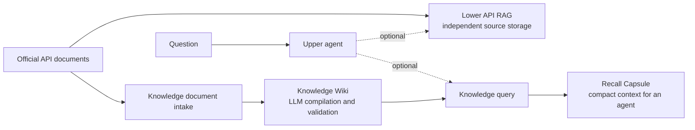

# Knowledge Module

[中文](README.md)

`src/knowledge` is an independent LLM Wiki knowledge compilation and retrieval module. It may
receive the same official documents as the API RAG, but it does not call, depend on, or modify the
API RAG.

The lower RAG is a separate library that stores and retrieves official manuals. The Knowledge module
is a set of LLM-assisted index cards built from supplied documents. Every fact on a card must point
back to an exact source part before it can be published. A Knowledge query searches only its own
published cards and returns a compact packet for a calling agent. Whether the lower RAG is also
queried is decided by the upper agent.

## Product view

### What it does

The module has two isolated paths:

- **Update path:** document → LLM extraction → evidence validation → conservative merge → publish
  → derived index.
- **Query path:** question → Knowledge Artifact retrieval → hard scope filters → ranking → bounded
  context packet.

The query path is read-only. It never queries the lower RAG, invokes the LLM, or writes to storage by
itself.



### Why it exists

- It turns long, scattered documentation into reusable concepts, entities, comparisons, and
  relationships.
- It prevents unsupported LLM output from becoming a fact. Every Claim must have a valid
  `EvidenceRef` to a document part, hash, quote, and optional character range.
- It prevents similarly named APIs from being mixed across products or versions. Official casing is
  preserved, and automatic merging requires an exact identity match.
- It combines facts from multiple source documents without deleting previously validated Claims or
  their provenance.
- It returns a bounded `RecallCapsule` instead of filling an LLM context window with every hit.
- It recommends abstention for empty or weak-only retrieval instead of encouraging the caller to
  guess.

### Main concepts

| Code term | Product meaning |
|---|---|
| `Wiki` | The outer knowledge-space isolation boundary |
| `SourceOrigin` | Optional source metadata; it does not connect to an external RAG |
| `Source` | One logical source document supplied to the Knowledge layer |
| `SourcePart` | A stable, ordered source section with parent and heading information |
| `Artifact` | A structured knowledge card compiled from a Source |
| `Claim` | One factual statement on a card |
| `EvidenceRef` | The exact source citation that supports a Claim |
| `Staging` | A pre-publication area invisible to queries |
| `Catalog` | Pointers to the revisions that are currently published |
| `Recall Capsule` | The compact result packet intended for a calling LLM |
| `CacheMiss` | A compatibility response field; not generated from lower-RAG hits |
| `EnrichmentRequest` | A compatibility response field; processing is owned by an update task |

Supported Artifact types are `source`, `concept`, `entity`, `comparison`, and `exploration`.

### Current delivery status

| Capability | Status | Notes |
|---|---|---|
| Domain models | Implemented | Sources, parts, claims, evidence, relations, revisions, and results |
| LLM extraction | Adapter implemented | `OpenAIKnowledgeExtractor` accepts an OpenAI-compatible client |
| Deterministic validation | Implemented | Unsupported or out-of-scope output is blocked |
| Conservative merge | Implemented | Automatic update requires exact canonical identity |
| Staging and publishing | Implemented | In-memory reference and Mongo implementations |
| Knowledge Zvec indexing | Adapter implemented | Uses the separate `knowledge_wiki_v1` collection |
| Knowledge-only query | Implemented | Exact, alias, lexical, dense, sparse, and RRF fusion |
| Query HTTP API | Wired | `POST /api/v1/knowledge/query`, protected by a service key |
| Cache-miss reporting | Implemented | Reports recommendations without writing |
| Standalone relation graph | Reserved, not wired | Embedded relations are returned; production uses `EmptyRelationReader` |
| Update HTTP API | Wired | `POST /api/v1/knowledge/update`; returns explicit 503 without an LLM key |
| Raw Markdown parsing | Outside this module | Callers must create stable `KnowledgeDocumentInput` parts first |
| Review domain service | Protocols and in-memory operation store implemented | Mongo adapter and management API remain |
| Knowledge reindex | CLI/Service implemented | Supports dry-run, scoped rebuild, and consistency checks; no scheduler yet |

`rag_collection_id` / `rag_collection_ids` remain optional source annotations for compatibility. They
are not required for a Knowledge query and do not cause lower-RAG access. The
`MongoKnowledgeRepository.ensure_indexes()` is called by the application and the standalone reindex
CLI.

## Code view

### File map

| File | Responsibility |
|---|---|
| `models.py` | Update-domain models, stable IDs, state, and update results |
| `query_contracts.py` | Query options, hits, evidence, Capsule, Trace, and response models |
| `contracts.py` | Replaceable Extractor, Repository, and Index Writer protocols |
| `service.py` | The `update_knowledge` and `update_wiki` orchestration |
| `openai_extractor.py` | OpenAI-compatible structured Artifact extraction |
| `validation.py` | Deterministic provenance and scope validation |
| `merge.py` | Exact-identity matching and conservative merge rules |
| `repository.py` | In-memory Repository and test Index Writer |
| `mongo_repository.py` | Immutable Mongo revisions, staging, and Catalog pointers |
| `zvec_index.py` | Independent dense + sparse Artifact index |
| `reindex.py` | Catalog-based Knowledge index rebuild and consistency checks |
| `operations.py` | Review decisions and operation-state contracts |
| `review_service.py` | Evidence revalidation and pending-review service |
| `readers.py` | Independent published Artifact and relation reader interfaces |
| `ranking.py` | RRF fusion, confidence signals, and deterministic ordering |
| `context_builder.py` | Recall Capsule budget enforcement |
| `query_service.py` | End-to-end read-only query orchestration |
| `__init__.py` | Public module exports |

### Update flow

`KnowledgeUpdateService.update_knowledge()` performs the following steps for each document:

1. Reject a batch containing more than one Wiki.
2. Compare the source content hash and compiler fingerprint. An unchanged source skips the LLM.
3. Create an immutable Source revision.
4. Load existing Artifacts only from the exact Wiki, namespace, and version.
5. Ask the extractor for structured Artifact drafts. The extractor has no publish permission.
6. Verify extractor, prompt, model, and schema version metadata.
7. Verify every Claim and relation against the current document parts.
8. Merge only an exact Artifact identity; ambiguous cases become `pending_review`.
9. Write an invisible staging entry, then atomically switch the published Catalog pointers.
10. Upsert published active revisions to the derived Knowledge Zvec index.

An index failure does not roll back published facts. The result becomes `partial` and recommends
`rebuild_knowledge_indexes`. Documents are independent publication units, while each document's
Source and active Artifact pointers move together.

### Mongo visibility model

```text
Immutable history: knowledge_source_revisions / knowledge_artifact_revisions
Publication input: knowledge_update_staging
Current pointers:  knowledge_catalog (one document per Wiki)
```

The repository writes immutable revisions first and makes them visible with one atomic Catalog
update. Queries only follow Catalog pointers, so they cannot see a half-published document. The
Catalog revision is also an optimistic lock for concurrent updates to the same Wiki.

### Query flow

`KnowledgeQueryService.query_knowledge()` performs the following steps:

1. Require Wiki, official namespace, and version scope. A source collection is optional metadata.
2. Search the published Artifact reader and the independent Knowledge Zvec index.
3. Return an explicit 503 when the Knowledge reader is unavailable; never fall back to lower RAG.
4. Recheck Wiki, namespace, version, language, lifecycle, and provenance.
5. Fuse exact, alias, lexical, dense, and sparse rankings with deterministic RRF (`k=60`).
6. Optionally perform a bounded one-hop relation expansion. Production currently uses an empty
   relation reader.
7. Keep reads separate from writes; document reprocessing is owned by an independent update task.
8. Build a `micro`, `small`, `medium`, or `large` Recall Capsule under hard item and character limits.
9. Recommend abstention for no results or weak-only matches.
10. Return the five trace stages: `trigger → recall → rerank → inject → generate`. Generation is
    delegated to the calling agent.

`match_confidence` describes how well the query matched a candidate. A Claim's `confidence`
describes the strength of its supporting evidence. They are intentionally separate.

### Security and consistency boundaries

- Queries never call the lower RAG or `update_knowledge`.
- Whether to query the lower RAG is decided by the upper agent.
- The LLM extractor cannot publish or access the Repository directly.
- Zvec is a rebuildable index, not the source of truth. A vector hit without a published Catalog
  Artifact is discarded.
- Claims and relations cannot cross Wiki, namespace, or version boundaries.
- The update layer does not split or reorder caller-provided Source Parts.
- Index failure never deletes or rolls back facts already published in Mongo.

### Supplying Markdown documents

This module does **not** accept a Markdown path or parse Markdown. An upstream adapter must read the
file, resolve `wiki_id`, official namespace and version, generate stable ordered
`SourcePart` values, compute the document hash, and construct `KnowledgeDocumentInput`.

The preferred next integration is a converter from the project's existing ingestion model to
`KnowledgeDocumentInput`, rather than a second parser inside this module.

### Query example

```bash
curl -X POST http://127.0.0.1:8000/api/v1/knowledge/query \
  -H "Authorization: Bearer $KNOWLEDGE_API_KEY" \
  -H "Content-Type: application/json" \
  -d '{
    "query": "what does asc_reduce_max do",
    "wiki_id": "wiki-ascendc",
    "namespace": "AscendC",
    "version": "v1",
    "top_k": 10,
    "budget": "medium"
  }'
```

The namespace and version above only demonstrate the payload shape. Production requests must use
the exact official values stored in the Wiki. The request does not need a lower-RAG collection.

### Verification

```bash
uv run pytest \
  tests/unit/test_knowledge_update.py \
  tests/unit/test_knowledge_query_service.py \
  tests/unit/test_knowledge_artifact_reader.py \
  tests/unit/test_knowledge_query_gateway.py

uv run pytest tests/benchmark/test_knowledge_query_strategy.py
```

Standalone index rebuild:

```bash
uv run python -m src.cli.knowledge reindex --dry-run
```

## Related documentation

- [Knowledge update plane](../../docs/knowledge-update-plane.md)
- [Knowledge query plane](../../docs/knowledge-query.md)
- [Architecture](../../docs/architecture.md)
