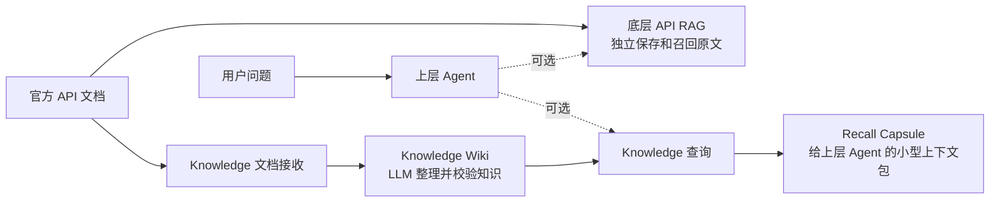
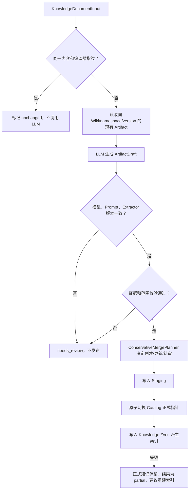
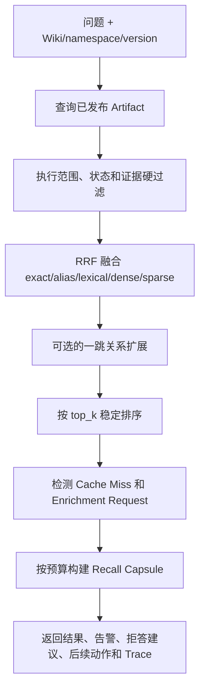

# Knowledge 模块说明

[English](README.en.md)

`src/knowledge` 是项目中的独立“LLM Wiki 知识整理与查询模块”。它可以接收与原 API RAG
相同的官方文档，但不会调用、依赖或修改原 API RAG。

如果把原来的 RAG 理解成一个保存官方手册并能按问题找原文的图书馆，那么 Knowledge
模块更像一套由 LLM 协助制作、但必须经过原文核验的独立知识卡片系统：它把分散在多个
文档中的概念、实体、对比信息和关系整理出来，记录每条结论来自哪一份文档的哪一段，
然后只查询自己的知识卡片。两者是否同时被使用，由上层 Agent 决定。

本文分成两部分：先从产品和功能角度说明它解决什么问题，再从代码角度说明每一步
具体如何运行。

## 一句话结论

这个目录实现的是：

> 接收外部提供的结构化文档，编译成有原文证据、按 Wiki/命名空间/版本隔离的知识；查询时
> 只召回 LLM Wiki 自己的知识，压缩成一个适合 LLM 使用的上下文包。

它包含两条互相隔离的链路：

- **知识更新链路**：文档 → LLM 整理 → 证据检查 → 保守合并 → 正式发布 → 建索引。
- **知识查询链路**：用户问题 → 查 Knowledge → 范围过滤 → 排序 → 压缩上下文 → 返回。

查询链路只读。查询发现知识缺失时，只返回“建议补充哪些文档”，不会偷偷触发 LLM，
也不会直接改数据库。

## 第一部分：从产品和功能角度理解

### 1. 它与底层 RAG 是什么关系

项目现在可以看成两层，但两层不是重复建设：

| 层级 | 保存什么 | 主要用途 | 例子 |
|---|---|---|---|
| 底层 API RAG | 官方文档原文和检索切片 | 找到最相关的原始说明 | 找到 `asc_reduce_max` 的函数说明、参数和示例 |
| 上层 Knowledge | LLM 从原文整理出的知识卡片，并附带证据 | 跨文档复用事实、概念、对比和关系 | “该函数在 Warp 内做最大值归约”，并指出结论来自哪个 Part |

因此，两者是两个独立产品：原 RAG 检索原始文档，LLM Wiki 检索整理后的知识。它们可以
接收同一份官方文档，但代码、存储和查询互不调用。



### 2. 它解决的产品问题

#### 原始文档太长、太散

同一个 API 的定义、限制、示例和注意事项可能位于多个段落，甚至来自不同 RAG
Collection。Knowledge 模块把它们整理成更容易复用的知识单元，减少每次都让模型从长文
中重新理解的成本。

#### LLM 整理内容可能“编出来”

模型生成的每条 `Claim` 都必须带 `EvidenceRef`。系统会检查文档 ID、文档库 ID、Part
ID、内容哈希、原文片段以及可选字符位置。任何一项对不上，整个文档本次生成的知识都
不能发布。

#### 同名 API 容易串版本或串产品

知识身份由 `wiki_id + namespace + version + artifact_type + canonical_name` 共同决定。
官方命名空间和版本保留原始大小写。只有这些字段完全相同，系统才会自动合并；否则宁可
保留为待审核，也不把两个“看起来像”的 API 当成同一个。

#### 多份文档的知识需要安全合并

LLM 只能提出合并建议，最后决定由确定性代码完成。新文档可以给同一个知识卡片补充事实，
但不会抹掉旧文档已经验证过的 Claim 和来源。

#### 上层 Agent 需要小而稳定的上下文

查询结果不是把所有原文塞给模型，而是按 `micro/small/medium/large` 四档预算生成
`Recall Capsule`。其中保留标题、摘要、置信度、命中信号、关系和来源，减少上下文浪费。

#### 没查到时不能假装知道

如果没有结果，或最好结果只是单路弱向量命中，响应会给出明确的 `abstention` 建议，
告诉调用方不要猜。Knowledge 查询不会因为另一个 RAG 的结果而生成缓存缺失，也不会自动
触发文档加工；文档是否需要重新整理，由独立的导入/更新任务决定。

### 3. 产品中的核心对象，用普通话解释

| 代码名称 | 通俗解释 |
|---|---|
| `Wiki` | 一套上层知识空间，是最外层隔离边界 |
| `SourceOrigin` | 可选的来源备注；不连接或调用外部 RAG |
| `Source` | 一份进入 Knowledge 层的原始逻辑文档 |
| `SourcePart` | 文档中稳定的一段，保留顺序、标题层级和父子关系 |
| `Artifact` | LLM 从原文整理出来的一张知识卡片 |
| `Claim` | 卡片中的一条具体结论 |
| `EvidenceRef` | 结论的原文定位信息，相当于脚注或引用 |
| `Relation` | 知识卡片之间的依赖、层级、引用等关系 |
| `Staging` | 发布前的临时区，用户查询看不到 |
| `Catalog` | 当前正式生效版本的指针清单 |
| `Recall Capsule` | 查询后交给上层 LLM 的精简知识包 |
| `CacheMiss` | 兼容旧响应的字段；独立 Knowledge 查询不会由外部 RAG 命中产生 |
| `EnrichmentRequest` | 兼容旧响应的字段；文档加工由独立导入/更新任务负责 |

Artifact 当前支持五种类型：

- `source`：进入 Wiki 的来源类型；不是对外部 RAG 的查询投影。
- `concept`：概念或规则，例如“Warp Reduce 是什么”。
- `entity`：具体 API、类、参数或命名实体。
- `comparison`：候选 API、版本或方案的差异卡。
- `exploration`：探索性整理结果；当前模块不会在查询时自动保存它。

### 4. 对用户可见的完整体验

以 `asc_reduce_max.md` 为例，理想的产品过程是：

1. 上游解析器读取 Markdown，给每个标题或段落分配稳定 `part_id`。
2. Knowledge 文档接收组件把 Markdown 转成稳定的 `KnowledgeDocumentInput`。
3. 后台调用 `update_knowledge`，LLM 把文档整理为 API 实体、行为说明、约束等知识卡片。
4. 代码检查每条结论是否真的能在该文档 Part 中找到。
5. 验证通过后发布卡片，并写入独立的 Knowledge Zvec 索引。
6. 用户询问“`asc_reduce_max` 是做什么的”时，Knowledge 只查询自己的知识卡片。
7. 系统过滤错误版本和错误命名空间，排序后返回一个小型 Recall Capsule。
8. 上层 Agent 根据 Capsule 生成最终自然语言回答或代码；Knowledge 模块自己不负责生成答案。

### 5. 当前已经做到什么

| 能力 | 当前状态 | 说明 |
|---|---|---|
| Knowledge 领域模型 | 已实现 | 文档、Part、Claim、证据、关系、修订和结果模型齐全 |
| LLM 结构化提取 | 已实现适配器 | `OpenAIKnowledgeExtractor` 接受 OpenAI 兼容 Client |
| 证据与范围校验 | 已实现 | 无证据、证据错误、跨范围内容会阻断发布 |
| 保守合并 | 已实现 | 仅规范身份完全一致时自动更新 |
| Staging 与发布 | 已实现 | 有内存参考实现和 Mongo 实现 |
| Knowledge Zvec 索引写入 | 已实现适配器 | 使用独立 `knowledge_wiki_v1` Collection |
| Knowledge 独立查询 | 已实现 | 只查询 Artifact，支持 exact、alias、lexical、dense、sparse 与 RRF |
| 查询 HTTP API | 已接入应用 | `POST /api/v1/knowledge/query`，不依赖原 RAG，需要服务密钥 |
| 文档补充与重新加工 | 独立任务负责 | 查询不读取原 RAG，也不根据原 RAG 命中推断缺失 |
| 独立关系图扩展 | 预留，未接入 | Artifact 内可保存关系，但生产组装使用 `EmptyRelationReader` |
| Knowledge 更新 HTTP API | 已接入应用 | `POST /api/v1/knowledge/update`；没有 LLM Key 时显式返回 503 |
| 原始 Markdown 解析 | 不属于本目录 | 调用方必须先生成 `KnowledgeDocumentInput` 和稳定 Parts |
| 审核领域服务 | 已实现协议和内存操作记录 | Mongo 审核适配器和管理 API 仍待补齐 |
| Knowledge 索引重建 | 已实现 CLI/Service | 支持 dry-run、Scope 重建和一致性检查；尚未接入定时调度 |

还有两个实现边界需要注意：

- `rag_collection_id` / `rag_collection_ids` 只作为可选来源标注保留，不再是 Knowledge 查询
  的必填条件，也不会触发原 RAG 访问。
- `MongoKnowledgeRepository.ensure_indexes()` 已由应用启动装配调用；独立 CLI 也会调用它。

## 第二部分：从代码角度理解

### 1. 目录分工

| 文件 | 作用 |
|---|---|
| `models.py` | 写入侧的领域模型、稳定 ID、状态和更新结果 |
| `query_contracts.py` | 查询请求、候选、证据、Capsule、Trace 等返回契约 |
| `contracts.py` | Extractor、Repository、Index Writer 三个可替换接口 |
| `service.py` | `update_knowledge` / `update_wiki` 的写入总流程 |
| `openai_extractor.py` | 调用 OpenAI 兼容模型，输出结构化 Artifact Draft |
| `validation.py` | 不使用 LLM 的确定性证据和范围校验 |
| `merge.py` | 精确身份匹配和保守合并规则 |
| `repository.py` | 内存 Repository 和测试用 Index Writer |
| `mongo_repository.py` | Mongo 不可变修订、Staging 和 Catalog 指针实现 |
| `zvec_index.py` | 派生 Artifact 的独立 dense + sparse Zvec 索引 |
| `reindex.py` | 从正式 Catalog 重建 Knowledge 索引并做一致性检查 |
| `operations.py` | 审核决定和操作状态的领域契约 |
| `review_service.py` | pending_review 的证据复核和审核服务 |
| `readers.py` | 独立 Artifact Reader 和关系 Reader 接口 |
| `ranking.py` | 多路命中的 RRF 融合、置信度与稳定排序 |
| `context_builder.py` | 按上下文预算压缩 Recall Capsule |
| `query_service.py` | `query_knowledge` 查询编排总流程 |
| `__init__.py` | 对外导出的稳定类型和类 |

### 2. 写入链路的具体逻辑

入口是 `KnowledgeUpdateService.update_knowledge()`；如果一个 Wiki 包含多个底层文档库，
可以先构造 `WikiUpdateInput` 再调用 `update_wiki()`。



逐步说明：

1. **限制一次只能更新一个 Wiki。** 一批文档如果包含多个 `wiki_id`，立即拒绝。
2. **判断是否需要重新加工。** `content_hash` 和 compiler fingerprint 都没变化时直接返回
   `unchanged`。fingerprint 包含 extractor、Prompt、模型和 Schema 版本。
3. **创建不可变 Source Revision。** 同一 Source 每次变更都增加 revision，而不是覆盖旧数据。
4. **只加载精确范围候选。** 合并候选必须与当前 Wiki、namespace、version 完全一致。
5. **调用 LLM。** Prompt 只包含当前 Source Parts 和候选摘要；模型只能返回 JSON 草稿，
   没有数据库发布权限。
6. **检查编译器元数据。** 防止模型或 Prompt 已变化，却把旧结果当成有效缓存。
7. **检查所有证据。** 证据必须属于当前 Collection 和文档，Part 必须存在，hash 和原文
   引用必须匹配，字符范围不能越界；关系也不能跨 Wiki、namespace 或 version。
8. **执行保守合并。** 只有稳定 Artifact ID 相同才会更新。更新会合并 alias、Claim、待解
   问题和关系，并保留所有来源。
9. **先 Staging，再 Publish。** Staging 中的数据对查询不可见；发布失败会标记 abandoned。
10. **最后更新索引。** 索引是可重建副本，所以索引失败不会回滚已经发布的正式知识，
    但结果会是 `partial` 并返回 `rebuild_knowledge_indexes`。

每份文档是独立发布单元：一份失败不会撤销同批次中已经成功发布的其他文档；但同一份文档
的 Source 和 Active Artifact 指针必须一起切换。

### 3. Mongo 中为什么有 Revision、Staging 和 Catalog

Mongo 实现没有直接覆盖“当前知识”，而是使用三层结构：

```text
不可变历史：knowledge_source_revisions / knowledge_artifact_revisions
发布候选：  knowledge_update_staging
当前指针：  knowledge_catalog（每个 Wiki 一份）
```

发布时先写不可变历史记录，最后用一次 `find_one_and_update` 原子更新该 Wiki 的 Catalog。
查询只顺着 Catalog 指针读，因此不会看到“Source 已更新、Artifact 只更新一半”的中间状态。
Catalog revision 还承担乐观锁作用：两个任务同时更新同一 Wiki 时，后发布者会发现指针已经
变化并失败，避免静默覆盖。

### 4. 查询链路的具体逻辑

稳定入口是 `KnowledgeQueryService.query_knowledge(query, options)`，HTTP 入口是
`POST /api/v1/knowledge/query`。



具体规则如下：

1. **查询必须带范围。** `wiki_id`、`namespace` 和 `version` 是必填项；来源 Collection
   标识是可选元数据，不是查询依赖。
2. **只查询 Knowledge。** Artifact Reader 读取 Mongo Catalog 中的 Active Artifact，并融合
   独立 Knowledge Zvec 命中。
3. **Knowledge 不可用时明确报错。** 查询不会退回原 RAG，因为两者是独立模块。
4. **编排层再次过滤。** Reader 即使返回了越界数据，也会再次检查 Wiki、官方大小写、版本、
   语言、状态和 provenance。没有有效证据的知识直接丢弃。
5. **确定性融合排序。** 使用 RRF `k=60`，exact、alias、active 状态和 Claim 置信度有小幅
   加成；同分时用固定字段排序，保证相同输入得到稳定顺序。
6. **关系扩展有硬上限。** 只允许从前三个结果做一跳扩展，并受 `relation_limit` 限制；当前
   生产环境使用空 Relation Reader，所以独立图扩展实际不会发生。
7. **保持读写分离。** 查询不会根据外部文档库的命中情况创建 Cache Miss 或 Enrichment
   Request；文档是否需要重新整理由独立更新任务决定。
8. **构建 Capsule。** 四档预算同时限制条目数、单条摘要长度和整包字符数。无法放下的内容
   会截断，并给出扩大预算后重查的 follow-up。
9. **明确是否应该拒答。** 空结果或只有弱匹配时，`abstention.recommended=true`。
10. **记录五阶段 Trace。** `trigger → recall → rerank → inject → generate`；最后的 generate
    标记为 delegated，因为真正回答由调用方 Agent 完成。

### 5. RRF 排序为什么不用直接比较向量分数

名称精确匹配、关键词匹配、dense 向量和 sparse 向量的分数范围不同，直接相加容易让某个
通道占据绝对优势。RRF 主要使用“候选在各通道中的名次”计算分数，再增加少量明确规则加成。
这样实现更容易解释，也便于单测保证结果稳定。

命中强度的判断是：

- 出现 `exact` 或 `alias` 信号：`strong`。
- 同一个候选被至少两个通道找到：`moderate`。
- 只有一个非精确信号：`weak`，建议谨慎或拒答。

这里的 `match_confidence` 表示“问题与候选匹配得有多好”；Claim 上的 `confidence` 表示
“事实证据有多强”。两者不是同一个概念。

### 6. 数据不会如何流动

以下限制是设计中的安全边界：

- 查询不会调用原 RAG，也不会调用 `update_knowledge`。
- 是否同时查询原 RAG，由更上层 Agent 决定。
- LLM Extractor 不直接访问 Repository，也不能发布知识。
- Knowledge Zvec 只是派生索引，不能成为正式事实来源；向量命中必须能与 Catalog 中 Active
  Artifact 对上，否则被丢弃。
- 不同 Wiki、namespace、version 的 Claim 或关系不能合并。
- 写入链路不会重新切分或重排调用方给出的 `SourcePart`。
- 索引失败不会删除或回滚 Mongo 中已经发布的正式知识。

### 7. 如何把一份 Markdown 文档交给它

`src/knowledge` **不接受 Markdown 文件路径，也不负责解析 Markdown**。调用方需要先完成：

1. 读取 Markdown。
2. 确定文档的 `wiki_id`、官方 `namespace` 和 `version`；来源系统信息只作为可选元数据。
3. 按稳定规则生成 `SourcePart`，包括唯一 `part_id`、严格递增 `order`、标题路径和内容。
4. 计算整份文档 `content_hash`。
5. 构造 `KnowledgeDocumentInput` 后调用更新 Service。

稳定 Part 很重要：如果每次导入都随机改变 `part_id` 或切分方式，旧 EvidenceRef 将难以与
新版本对齐。适合本项目的下一步是复用现有文档摄取结果，增加一个“底层文档模型 →
`KnowledgeDocumentInput`”转换器，而不是在 Knowledge 模块里再写一套解析器。

### 8. 对外查询示例

服务需要配置 `KNOWLEDGE_API_KEY`，调用方可使用 Bearer Token 或 `X-API-Key`。

```bash
curl -X POST http://127.0.0.1:8000/api/v1/knowledge/query \
  -H "Authorization: Bearer $KNOWLEDGE_API_KEY" \
  -H "Content-Type: application/json" \
  -d '{
    "query": "asc_reduce_max 是做什么的",
    "wiki_id": "wiki-ascendc",
    "namespace": "AscendC",
    "version": "v1",
    "language": "zh-CN",
    "top_k": 10,
    "budget": "medium",
    "include_stale": false,
    "expand_relations": true,
    "relation_limit": 6
  }'
```

namespace 和 version 必须使用数据中真实保存的官方值；上面的 `AscendC` 和 `v1` 仅用于
展示请求结构。请求不需要提供原 RAG 的 Collection。

### 9. 测试与验收

核心单元测试：

```bash
uv run pytest \
  tests/unit/test_knowledge_update.py \
  tests/unit/test_knowledge_query_service.py \
  tests/unit/test_knowledge_artifact_reader.py \
  tests/unit/test_knowledge_query_gateway.py
```

查询策略回归：

```bash
uv run pytest tests/benchmark/test_knowledge_query_strategy.py
```

验收时至少应确认：

- 相同文档和相同编译器版本不会重复调用 LLM。
- 错误 EvidenceRef 无法发布。
- 相同名称但不同 namespace/version 的知识不会合并。
- 不启动原 RAG 时，Knowledge 仍可独立写入和查询。
- Knowledge 查询结果不会出现原 RAG 的 Source 命中或补充请求。
- Knowledge 索引失败时正式知识仍然存在，更新结果为 `partial`。
- 越界、无 provenance 和默认 stale 的查询结果不会返回。
- 只有弱命中时返回拒答建议。
- `micro` Capsule 不超过硬字符预算。
- Gateway 未配置密钥时默认关闭，Knowledge Artifact Reader 失败时返回 503。
- Knowledge 更新没有 LLM Provider 时返回 503，不会影响只读查询。
- Reindex 失败不会修改 Mongo 正式知识。

## 相关文档

- [Knowledge 写入面设计](../../docs/knowledge-update-plane.md)
- [Knowledge 查询面设计](../../docs/knowledge-query.md)
- [项目架构](../../docs/architecture.md)
